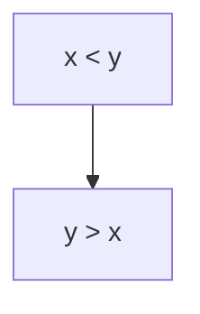

# Project-specific Agent Instructions

These are project-specific guidelines for Codex-driven development.

## Mermaid Diagrams

When generating Mermaid diagrams inside Markdown, follow **strict syntax rules** to ensure diagrams render correctly in all environments.

---

### General Guidelines

- Enclose Mermaid code in triple backticks with `mermaid` as the language:

  ```mermaid
  graph TD
  A --> B
  ```

- Use **graph direction** keywords like `TD`, `LR`, `TB`, `RL`, or `BT` immediately after `graph`.

---

### Comments

- **No inline comments:** Place Mermaid comments (`%% ...`) on their own lines, at the beginning of the line.
- **Example of a valid comment:**

```mermaid
%% This is a valid Mermaid comment on its own line
A --> B
```

Avoid inline comments like:

```mermaid
A --> B %% Invalid inline comment
```

---

### Text Escaping Rules

Certain characters must be escaped or avoided in **labels**, **node content**, or **text**:

| Character | Do not use         | Use instead                 |
| --------- | ------------------ | --------------------------- |
| `<`       | `<`                | `&lt;`                      |
| `>`       | `>`                | `&gt;`                      |
| `&`       | `&`                | `&amp;`                     |
| `"`       | `"` in some themes | Use `'` or escape carefully |
| `'`       | OK                 | OK                          |

**Example:**



## Project Instructions

- **Code creation scope:** Codex should only generate or modify code within the `examples` directory.
- **Standalone project:** The projects managed with codex cli are independent. Do not import or rely on code from `app` or `experiments`; they are only for reference.
- **Project organization:** Each sub-project has its own sub-folder under `examples` (e.g. `examples/project1`, `examples/project2`). These projects are autonomous AI agents managed with the Agents SDK or MCP client, and they may only interact through a clean, defined interface (MCP, function calls, or REST API). The protocol must be defined in the specification.
- **Specifications, plan and sprint:** Each sub-project must have a dedicated `specifications` folder (e.g. `examples/project1/specifications/`) containing planning files (`plan_*.md`) that define project goals, components, and architecture (workflow diagrams, sequence diagrams), and sprint files (`sprint_*.md`) that define the order of user stories. Code generation must strictly follow these specifications, and no component may be created without a prior definition in the specification files.
- **Naming & structure compliance:** Naming conventions and directory structures must strictly follow the specification files (plan\*.md) in `examples/*/specifications/` folder. Any deviation requires prior discussion and approval.
- **Execution order & spec-first compliance:** Implementations must follow the order of user stories as defined in the sprint files (`sprint_*.md`) within each sub-project’s `specifications` folder. Any new user stories or architectural components must be defined in the sprint or plan specification files and approved before implementation. No code change that is not reflected in the specifications may be made.
- **Specification approval before coding:** All feature requests, architectural decisions, and priority changes must first be captured and updated in the specification files (`plan_*.md`, `sprint_*.md`). Codex must await explicit approval of these spec changes before making any code or documentation edits. Implementation details belong in project documentation (e.g., README or a designated docs folder), not in the specification files.

- **Package management:** Projects should be managed with Poetry; any launch scripts (`*.sh`) must use `poetry run` rather than calling `python` directly.
- **Fast execution (MCP):** MCP clients and servers should be launched using the `uv` or `uvx` commands for fast execution.

- **GitHub Interaction Annotation:** When Codex interacts with GitHub via the CLI (`gh`)—such as creating or commenting on Issues and Pull Requests—it must clearly annotate all comments and commands to indicate that it is Codex performing the action, so that contributions from other agentic developers (e.g., Claude Code) remain distinguishable.

## Code Generation

When generated code, please follow these rules:

- **Generated code location:** All code for the `GenAI training transcript` agent must be placed under `examples/genai_training_transcript`.
