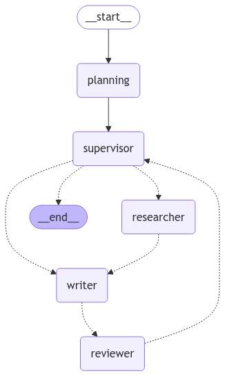
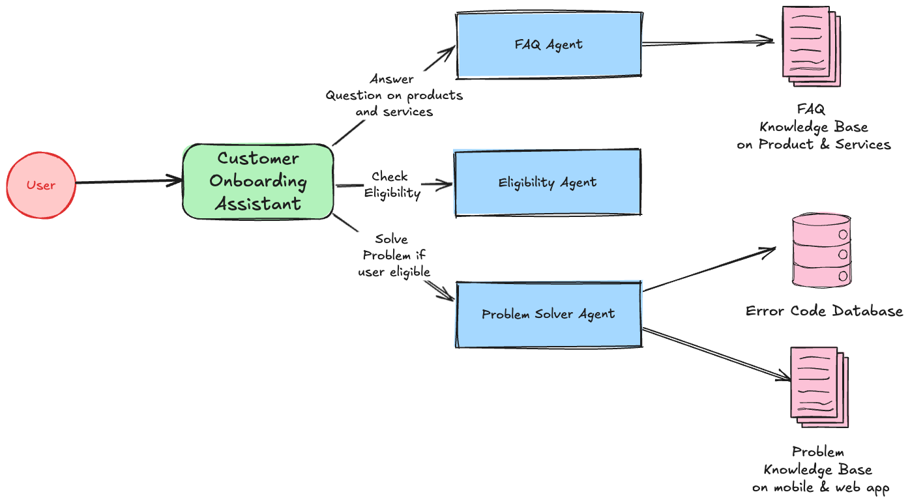
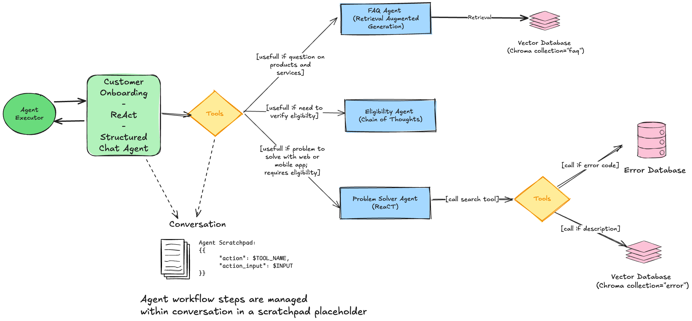
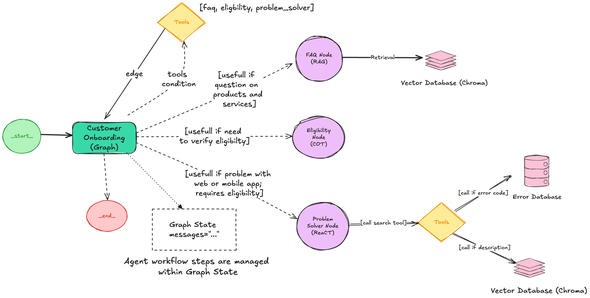
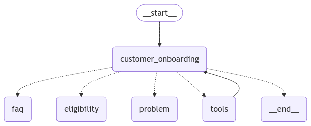

# AI Agent Casebook

This project showcases real-world implementations of **AI multi-agent systems**, using agentic frameworks such as **LangGraph** and **OpenAI's Agents SDK**.

## 🔍 Overview

We currently demonstrate two end-to-end agent workflows:

- **Customer Onboarding Assistant**
- **Video Script Assistant**

The goal is to explore production-ready AI agent use cases, focusing on:

- Agent orchestration (LangGraph, OpenAI Agents SDK)
- Multi-provider LLM compatibility (Mistral, OpenAI, Anthropic)
- Retrieval-Augmented Generation (ChromaDB, LlamaIndex)
- Evaluation & Testing of agent behavior

Future additions may include [CrewAI](https://www.crewai.com/open-source) and [PydanticAI](https://ai.pydantic.dev/).

---

## Roadmap

### Core

- Shared agent tools and testing setup

### Customer Onboarding Assistant

- Initial implementation
- Improve eligibility controls
- Streaming with server-sent events (SSE)
- Data refactor & backend cleanup

### Video Script Assistant

- Initial version with LangGraph
- Refactor planner with OpenAI Agents SDK
- Research + Ideation agent loop
- Final script review & CoT improvements

### RAG & Evaluation (WIP)

- Query Augmentation strategies
- Advanced testing with LangSmith & synthetic data

---

## Installation

### 1. Clone the repository

```bash
git clone https://github.com/BittnerPierre/AI-Agent-Casebook
cd AI-Agent-Casebook
```

### 2. Set up environment variables

Create a `.env` file in the root directory:

```dotenv
# Required LLM providers
MISTRAL_API_KEY=your-mistral-key
OPENAI_API_KEY=your-openai-key
LANGCHAIN_API_KEY=your-langchain-key
```

> ⚠️ We recommend using [LangSmith](https://smith.langchain.com/) to monitor workflows. It's free for individual developers.

### 3. Install dependencies

This project uses **Poetry** with Python `>=3.12`.

```bash
poetry install
```

To activate the virtual environment:

```bash
poetry shell
```

### 4. Configure models and features

The project uses `app/config.ini` for model configuration and feature settings. Alternative config files like `config-gpt-4o-mini.ini` are available for testing different models.

#### Model Configuration

```ini
[CustomerOnboarding]
model = GPT_5_MINI

[VideoScript]
# Planner uses Agents SDK (model name as-is, with litellm prefix for non-OpenAI)
planner_model = gpt-4o-mini
# Worker and producer use core enums (see app/core/base.py)
worker_model = GPT_4_O_MINI
producer_model = GPT_4_O_MINI

[CorrectiveRAG]
model = GPT_4_O_MINI
# Pre-load documents at startup (comma-separated URLs)
preload_urls = https://lilianweng.github.io/posts/2023-06-23-agent/,https://lilianweng.github.io/posts/2023-03-15-prompt-engineering/
```

#### Corrective RAG (CRAG) Configuration

The CRAG system automatically pre-loads documents at startup from configured URLs:

- **`preload_urls`**: Comma-separated list of URLs to load into the vector store
- Documents are chunked and embedded using the same model specified in the config
- This ensures the CRAG system has actual content instead of relying only on web search fallback
- Useful for domain-specific knowledge that should be readily available

**Example URLs that work well:**

- Technical blog posts (markdown/HTML format)
- Documentation pages
- Research papers (if accessible as HTML)

> ⚠️ Large documents (like PDFs) may hit embedding API token limits and require smaller chunk sizes.

## 🔒 Security & Vulnerability Scanning

This project includes automated security scanning of dependencies to ensure a secure development environment.

### Vulnerability Audit

The project includes `poetry-audit-plugin` as a development dependency for security scanning:

```bash
# Scan for vulnerabilities in project dependencies
poetry audit
```

This command scans all project dependencies against the Python Packaging Advisory Database and reports any known security vulnerabilities.

### For Team Members

When you clone the project and run `poetry install`, the audit plugin will be automatically available. Run `poetry audit` regularly to ensure your dependencies remain secure.

### CI/CD Integration

Consider adding `poetry audit` to your CI/CD pipeline to catch vulnerabilities early:

```yaml
# Example GitHub Actions step
- name: Security Audit
  run: poetry audit
```

---

## 📂 Project Structure

```bash
AI-Agent-Casebook/
│
├── app/                  # Main app logic and LangGraph workflows
├── data/                 # Fake onboarding data (vectorstore, SQLite)
├── tests/                # Agent test coverage (unit + integration)
├── tools/                # LangSmith suite and evaluation helpers
├── tutorials/            # Notebooks & walk-throughs
└── res/                  # Images and workflow diagrams
```

---

## Video Script Generator

A complete tutorial (in French) is available:

🎥 [Watch the YouTube video](https://www.youtube.com/live/0KY-73mwCdQ)

📘 [Tutorial (HTML)](https://bittnerpierre.github.io/AI-Agent-Casebook/tutorials/agentic-script-writer.html)
📓 [Notebook](https://github.com/BittnerPierre/AI-Agent-Casebook/blob/main/tutorials/agentic-script-writer.ipynb)

State graph (LangGraph):



### Example Prompts

**Simple prompt (web search only):**

```
"I'd like a 1-chapter video of 1 minute of 160 words on 'AI Won't Take Your Jobs. Those Who Use AI Will!', please!"
```

**Detailed prompt (tests CRAG system):**

```
"I'd like a YouTube Shorts script of about 3 minutes (~450 words) on the topic: The Memory Problem in AI Agents.

Structure: Hook + 3 chapters.

Chapter 1 (~150 words): What is the memory problem? Explain how current AI agents are stateless and forget context between interactions. Cover why this is a fundamental limitation for autonomous agents.

Chapter 2 (~150 words): Memory system solutions. Explain the different types of memory being developed: short-term memory (conversation context), long-term memory (persistent knowledge), and external memory (vector stores, databases). Give concrete examples.

Chapter 3 (~150 words): Real-world impact and future. How memory systems enable more sophisticated agent behaviors like learning from past interactions, building knowledge over time, and maintaining context across sessions. What this means for the future of AI agents.

Target audience: Developers new to AI agents who want to understand the technical challenges."
```

> 💡 The first example will primarily use web search, while the second tests the Corrective RAG system with pre-loaded knowledge about AI agents.

---

## Customer Onboarding Assistant

Project to demonstrate onboarding automation using agentic workflows.

[Watch the YouTube video (French)](http://www.youtube.com/watch?v=_rctwY6sVFM)

### Architectures

- **Functional view**

  

- **LCEL + React-like output**

  

- **LangGraph agent loop**

  

- **Generated graph**

  

### Testing

- Use `poetry run pytest tests` with coverage across workflows
- Some tests are expected to fail: they demonstrate edge cases or brittle logic under test

---

## Front-End (Separate Repo)

The front-end (React/TypeScript) is available here:
[AI-Agent-Casebook-UI](https://github.com/BittnerPierre/AI-Agent-Casebook-UI)

> Designed for deployment on **Vercel**, communicating with the backend via API.

---

## Run Locally

To run the agent workflows locally (development mode):

```bash
poetry run langgraph dev --allow-blocking
```

Note: --allow-blocking is required when used with GPT-5 and Agents SDK (planner) has it is doing asynchronous call with litellm.

---

## License

Distributed under the **Apache License 2.0**.

---

## Credits & Inspiration

- [LangGraph](https://github.com/langchain-ai/langgraph) example simulators (pytest-style workflows)
- [agent-service-toolkit](https://github.com/JoshuaC215/agent-service-toolkit/) for ideas on streaming graphs to the UI
