# C4 Architecture - Agentic Content Production Platform

## C4 Component Diagram (Mermaid)

```mermaid
C4Component
    title Component Diagram - Agentic Content Production Platform

    Person(content_creator, "Content Creator", "Creates training courses from syllabus specifications")
    
    System_Boundary(platform_boundary, "Agentic Content Production Platform") {
        
        Container_Boundary(knowledge_mgmt, "Knowledge Management") {
            Component(training_manager, "Training Manager", "Agent SDK", "Preprocesses and indexes training course materials")
            Component(content_accessor, "Content Accessor", "Python", "Provides searchable access to processed content")
            Component(knowledge_bridge, "Knowledge Bridge", "MCP Server", "MCP interface for knowledge queries and content retrieval")
            ComponentDb(knowledge_db, "Knowledge Database", "Local Files/JSON", "Stores processed training materials and metadata")
        }
        
        Container_Boundary(authoring_content, "Authoring Content") {
            Component(workflow_orchestrator, "Workflow Orchestrator", "Agent SDK", "Coordinates the content creation pipeline")
            Component(research_team, "Research Team", "Agent SDK", "Queries knowledge and creates research notes")
            Component(editing_team, "Editing Team", "Agent SDK + Response API", "Synthesizes content using file_search on syllabus+agenda+research notes")
            Component(editorial_finalizer, "Editorial Finalizer", "Agent SDK", "Reviews content quality and tracks issues")
            Component(file_operations_mcp, "File Operations MCP", "MCP Server", "Handles workflow file operations")
            ComponentDb(workflow_files, "Workflow Files", "Local JSON Files", "research_notes/, chapter_drafts/, quality_issues.json")
        }
        
        Container_Boundary(evaluation_optimization, "Evaluation & Optimization") {
            Component(evaluation_logger, "Evaluation Logger", "Python", "Logs agent conversations and workflow execution")
            Component(rag_evaluator, "RAG Evaluator", "LLM-as-Judge", "Evaluates knowledge retrieval quality")
        }
        
        Container_Boundary(cli_interface, "CLI Interface") {
            Component(transcript_generator_cli, "Transcript Generator CLI", "Python Click", "Command-line interface for workflow execution")
        }
    }
    
    System_Ext(langsmith_system, "LangSmith Platform", "External evaluation and tracing platform (via Agent SDK)")
    System_Ext(openai_api, "OpenAI API", "Response API with file_search capabilities")
    
    %% Person interactions
    Rel(content_creator, transcript_generator_cli, "Executes", "transcript-generator --syllabus course.json")
    
    %% CLI connections
    Rel(transcript_generator_cli, workflow_orchestrator, "Initiates workflow", "Agent SDK")
    Rel(transcript_generator_cli, knowledge_bridge, "Initializes knowledge access", "MCP setup")
    
    %% Knowledge Management internal
    Rel(training_manager, content_accessor, "Provides processed content", "Python API")
    Rel(content_accessor, knowledge_db, "Reads/writes", "File I/O")
    Rel(knowledge_bridge, content_accessor, "Serves content queries", "Python API")
    
    %% Authoring workflow
    Rel(workflow_orchestrator, research_team, "Triggers research", "Agent SDK")
    Rel(research_team, knowledge_bridge, "Queries knowledge", "MCP Protocol")
    Rel(research_team, file_operations_mcp, "Writes research_notes/", "MCP Protocol")
    
    Rel(workflow_orchestrator, editing_team, "Triggers editing", "Agent SDK")
    Rel(editing_team, file_operations_mcp, "Reads research_notes/", "MCP Protocol")
    Rel(editing_team, openai_api, "Multi-step synthesis", "Response API file_search (syllabus+agenda+research)")
    Rel(editing_team, file_operations_mcp, "Writes chapter_drafts/", "MCP Protocol")
    
    Rel(workflow_orchestrator, editorial_finalizer, "Triggers review", "Agent SDK")
    Rel(editorial_finalizer, file_operations_mcp, "Reads chapter_drafts/", "MCP Protocol")
    Rel(editorial_finalizer, file_operations_mcp, "Writes quality_issues.json", "MCP Protocol")
    
    %% File Operations MCP
    Rel(file_operations_mcp, workflow_files, "Manages workflow files", "File I/O")
    
    %% Evaluation
    Rel(workflow_orchestrator, evaluation_logger, "Logs execution", "Agent SDK built-in tracing")
    Rel(evaluation_logger, rag_evaluator, "Triggers evaluation", "Python API")
    Rel(rag_evaluator, file_operations_mcp, "Reads quality data", "MCP Protocol")
    Rel(evaluation_logger, langsmith_system, "Auto-traces", "Agent SDK integration")
    
    %% Results
    Rel(workflow_orchestrator, transcript_generator_cli, "Returns final transcript", "Agent SDK")
    Rel(transcript_generator_cli, content_creator, "Delivers", "final_transcript.json")

    UpdateLayoutConfig($c4ShapeInRow="3", $c4BoundaryInRow="1")
```

## Comprehensive Element Descriptions

### Persons (External Actors)

#### Content Creator
- **Role:** Primary user of the system
- **Responsibilities:** 
  - Creates syllabus specifications for training courses
  - Executes the content generation workflow
  - Reviews and validates generated transcripts
- **Interaction Points:** CLI interface only
- **Technical Level:** Non-technical user, expects simple command-line operation

### Systems (External Dependencies)

#### LangSmith Platform
- **Type:** External SaaS platform
- **Purpose:** Evaluation, tracing, and analytics for LLM applications
- **Integration:** REST API for sending execution metadata and traces
- **Data Sent:** Agent conversation logs, performance metrics, quality assessments
- **Owned By:** LangChain/LangSmith team

#### OpenAI API
- **Type:** External AI service
- **Purpose:** Content synthesis using Response API with file_search capability
- **Integration:** REST API with structured file operations
- **Usage Pattern:** EditingTeam uploads research notes and queries for chapter synthesis
- **Owned By:** OpenAI

### Containers (High-Level Services)

#### Knowledge Management Container
- **Purpose:** Manages the knowledge base of training materials
- **Technology Stack:** Python, Local file storage, JSON metadata, MCP protocol
- **Responsibilities:**
  - Preprocessing and indexing training course materials
  - Providing searchable access to content via simple file operations
  - Serving knowledge queries via MCP interface
- **Data Owned:** Training materials, course metadata stored as local files and JSON
- **Deployment:** Single process with MCP server interface
- **Sprint 1 Scope:** File-based storage only, no semantic search or vector operations

#### Authoring Content Container  
- **Purpose:** Core content creation workflow orchestration
- **Technology Stack:** Agent SDK, Python, MCP protocol, Response API
- **Responsibilities:**
  - Coordinating multi-agent content creation pipeline
  - Research phase: knowledge gathering and note creation
  - Editing phase: multi-step content synthesis using syllabus+agenda+research notes
  - Review phase: quality assessment and issue tracking
- **Data Owned:** Intermediate workflow files (research_notes/, chapter_drafts/, quality_issues.json) via separate File Operations MCP
- **Deployment:** Multiple Agent SDK agents coordinated by orchestrator
- **Future Components (Next Sprint):** Memory, Planner, Task Execution, Human-in-the-loop

#### Evaluation & Optimization Container
- **Purpose:** Quality assessment and performance analytics
- **Technology Stack:** Python, LLM-as-Judge, Agent SDK built-in LangSmith integration
- **Responsibilities:**
  - Logging agent conversations and execution traces (automated via Agent SDK)
  - Evaluating knowledge retrieval quality (RAG metrics)
  - Automatic trace collection to LangSmith platform
- **Data Owned:** Evaluation logs, quality metrics, performance traces
- **Deployment:** Background processes triggered by workflow events
- **Integration:** Agent SDK provides built-in LangSmith tracing - no custom API client needed

#### CLI Interface Container
- **Purpose:** User-facing command-line interface
- **Technology Stack:** Python Click framework
- **Responsibilities:**
  - Accepting syllabus input from users
  - Initiating workflow orchestration
  - Returning final transcript results
- **Data Owned:** None (stateless interface)
- **Deployment:** Command-line application

### Components (Internal Implementation Details)

#### Knowledge Management Components

**Training Manager**
- **Technology:** Agent SDK
- **Function:** Preprocesses raw training materials into structured, searchable format
- **Inputs:** Raw course files (PDFs, videos, text)
- **Outputs:** Processed content with metadata
- **Dependencies:** Content Accessor for data persistence

**Content Accessor**
- **Technology:** Python data layer
- **Function:** Provides programmatic access to processed training content via simple file operations
- **Inputs:** Search queries, content IDs (keyword-based, no semantic search)
- **Outputs:** Structured content responses from local files
- **Dependencies:** Knowledge Database (local files) for storage

**Knowledge Bridge**
- **Technology:** MCP Server implementation
- **Function:** Exposes knowledge operations via MCP protocol
- **Inputs:** MCP knowledge queries from research agents
- **Outputs:** Knowledge responses in standardized format
- **Dependencies:** Content Accessor for content retrieval

**Knowledge Database**
- **Technology:** Local file storage with JSON metadata
- **Function:** Persistent storage for processed training materials
- **Data Types:** Text files, JSON metadata, simple file-based organization
- **Query Types:** File system search, keyword matching, metadata filtering
- **Sprint 1 Scope:** No vector embeddings, semantic search, or database operations

#### Authoring Content Components

**Workflow Orchestrator**
- **Technology:** Agent SDK coordination layer
- **Function:** Manages the sequential execution of content creation phases
- **Responsibilities:** Agent lifecycle management, error handling, progress tracking
- **State Management:** Stateless coordination with MCP file persistence
- **Dependencies:** All authoring agents (Research Team, Editing Team, Editorial Finalizer)

**Research Team**
- **Technology:** Agent SDK multi-agent system
- **Function:** Researches syllabus topics using knowledge base
- **Process:** Query knowledge → Extract key points → Create structured research notes
- **Outputs:** research_notes/{section_id}.json files via MCP
- **Dependencies:** Knowledge Bridge for content queries, File Storage for output

**Editing Team**
- **Technology:** Agent SDK + OpenAI Response API integration
- **Function:** Synthesizes content into coherent chapter content using multi-step RAG approach
- **Process:** Read research notes → Combine with syllabus+agenda → Use file_search for synthesis → Generate chapter drafts
- **Key Innovation:** Uses Response API file_search on combined syllabus+agenda+research notes for multi-step generation
- **Narrative Integration:** Applies training course narrative guidelines internally (not separate component)
- **Dependencies:** File Operations MCP for input/output, OpenAI API for synthesis

**Editorial Finalizer**
- **Technology:** Agent SDK with quality assessment logic
- **Function:** Reviews generated content for quality issues and narrative consistency
- **Assessment Areas:** Content accuracy, pedagogical structure, narrative flow
- **Outputs:** quality_issues.json with approval/rejection decisions
- **Dependencies:** File Operations MCP for content access and quality data persistence

**File Operations MCP**
- **Technology:** MCP Server for workflow file management
- **Function:** Handles all read/write operations for workflow intermediate files
- **File Types:** research_notes/, chapter_drafts/, quality_issues.json, final_transcript.json
- **Access Pattern:** MCP protocol operations for all workflow file I/O
- **Purpose:** Clean API separation for future MCP Evernote migration
- **Storage Backend:** Local JSON files on filesystem

**Workflow Files**
- **Technology:** Local JSON files
- **Function:** Persistent storage for all workflow intermediate data
- **Organization:** Directory-based structure (research_notes/, chapter_drafts/, etc.)
- **Format:** JSON files following defined schemas
- **Access:** Only via File Operations MCP (no direct file system access)

#### Evaluation & Optimization Components

**Evaluation Logger**
- **Technology:** Agent SDK built-in logging with automatic LangSmith integration
- **Function:** Captures agent conversations and workflow execution traces automatically
- **Data Captured:** Agent inputs/outputs, execution timing, error events (via Agent SDK)
- **Storage:** Automatic trace collection to LangSmith platform
- **Dependencies:** Agent SDK provides built-in tracing - no custom implementation needed

**RAG Evaluator**
- **Technology:** LLM-as-Judge evaluation framework
- **Function:** Assesses quality of knowledge retrieval and usage
- **Metrics:** Context relevance, answer relevance, grounding (RAG Triad)
- **Process:** Analyze knowledge queries → Score retrieval quality → Generate metrics
- **Dependencies:** File Operations MCP for quality data access
- **Integration:** Works with Agent SDK automatic tracing

#### CLI Interface Components

**Transcript Generator CLI**
- **Technology:** Python Click framework
- **Function:** Single command interface for entire workflow execution
- **Command:** `transcript-generator --syllabus <file>`
- **Process:** Parse syllabus → Initialize Knowledge Management → Trigger orchestrator → Return final transcript
- **Error Handling:** User-friendly error messages and progress indicators
- **Dependencies:** Workflow Orchestrator for pipeline execution, Knowledge Bridge for knowledge access setup

## Key Architectural Decisions

### Technology Choices
- **Agent SDK:** Multi-agent coordination with built-in LangSmith tracing
- **MCP Protocol:** Clean API separation - separate servers for Knowledge and File operations
- **Response API:** Multi-step content synthesis with file_search (syllabus+agenda+research notes)
- **Local Storage:** JSON files for all data (no SQLite/VectorDB in Sprint 1)

### Data Flow Patterns
- **Sequential Processing:** Research → Editing → Review phases
- **Dual MCP Design:** Knowledge Bridge MCP + File Operations MCP for clean separation
- **Stateless Components:** No shared state between agents, persistence via MCP file operations
- **Clean Contracts:** Simplified JSON schemas for all inter-component communication

### Integration Strategy
- **MCP-First Design:** All file operations via MCP for future Evernote migration
- **Dual MCP Servers:** Knowledge access vs workflow file operations separation
- **Built-in Tracing:** Agent SDK automatic LangSmith integration (no custom API client)
- **File-Based Knowledge:** Simple local file storage, no semantic search for Sprint 1
- **Multi-Step Synthesis:** Response API file_search with combined syllabus+agenda+research input

### Sprint 1 Scope
- **Knowledge Management:** File-based storage only, keyword matching, no vector operations
- **Authoring Content:** Core workflow with narrative guidelines integrated into Editing Team
- **Evaluation:** Basic quality assessment with automatic Agent SDK tracing
- **Future Components (Next Sprint):** Memory, Planner, Task Execution, Human-in-the-loop, Vector/Graph databases

This architecture prioritizes KISS principles for Sprint 1 while maintaining clean MCP separation for future Evernote migration.