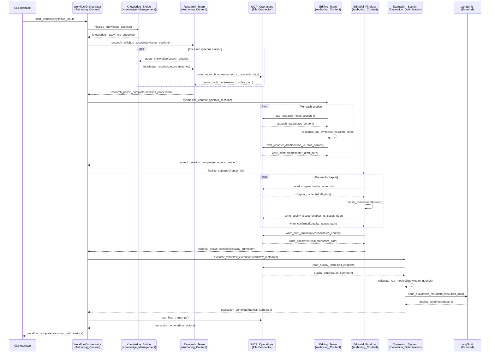

# Inter-Module Architecture & Data Exchange Specifications

## Business Domain Modules

### 1. Knowledge_Management
- **Components:** training_manager, content_accessor, knowledge_bridge
- **Responsibility:** Provides searchable knowledge base access
- **Interface:** MCP Knowledge Server

### 2. Authoring_Content  
- **Components:** research_team, editing_team, editorial_finalizer
- **Responsibility:** Content creation workflow from syllabus to final transcript
- **Interface:** Agent SDK coordination + MCP file operations

### 3. Evaluation_Optimization
- **Components:** evaluation_logger, rag_evaluator, langsmith_integration  
- **Responsibility:** Quality assessment and performance analytics
- **Interface:** MCP file access + LangSmith API

## Inter-Module Sequence Diagram



## Data Exchange Schemas

### 1. Syllabus Input Schema
```json
{
  "$schema": "http://json-schema.org/draft-07/schema#",
  "title": "SyllabusInput",
  "type": "object",
  "properties": {
    "course_title": {"type": "string"},
    "course_description": {"type": "string"},
    "sections": {
      "type": "array",
      "items": {
        "type": "object",
        "properties": {
          "section_id": {"type": "string"},
          "title": {"type": "string"},
          "learning_objectives": {"type": "array", "items": {"type": "string"}},
          "key_topics": {"type": "array", "items": {"type": "string"}},
          "estimated_duration": {"type": "string"}
        },
        "required": ["section_id", "title", "learning_objectives", "key_topics"]
      }
    }
  },
  "required": ["course_title", "sections"]
}
```

### 2. Knowledge Query Schema (Authoring_Content → Knowledge_Management)
```json
{
  "$schema": "http://json-schema.org/draft-07/schema#",
  "title": "KnowledgeQuery",
  "type": "object",
  "properties": {
    "query_id": {"type": "string"},
    "search_keywords": {"type": "array", "items": {"type": "string"}},
    "learning_objectives": {"type": "array", "items": {"type": "string"}},
    "content_type_filter": {"type": "array", "items": {"type": "string"}},
    "max_results": {"type": "integer", "default": 10}
  },
  "required": ["query_id", "search_keywords"]
}
```

### 3. Knowledge Response Schema (Knowledge_Management → Authoring_Content)
```json
{
  "$schema": "http://json-schema.org/draft-07/schema#",
  "title": "KnowledgeResponse",
  "type": "object",
  "properties": {
    "query_id": {"type": "string"},
    "total_matches": {"type": "integer"},
    "content_matches": {
      "type": "array",
      "items": {
        "type": "object",
        "properties": {
          "content_id": {"type": "string"},
          "title": {"type": "string"},
          "relevance_score": {"type": "number", "minimum": 0, "maximum": 1},
          "content_preview": {"type": "string"},
          "metadata": {
            "type": "object",
            "properties": {
              "source": {"type": "string"},
              "content_type": {"type": "string"},
              "tags": {"type": "array", "items": {"type": "string"}}
            }
          }
        },
        "required": ["content_id", "title", "relevance_score", "content_preview"]
      }
    }
  },
  "required": ["query_id", "total_matches", "content_matches"]
}
```

### 4. Research Notes Schema (MCP File: research_notes/{section_id}.json)
```json
{
  "title": "ResearchNotes",
  "type": "object",
  "properties": {
    "section_id": {"type": "string"},
    "knowledge_references": {
      "type": "array",
      "items": {
        "type": "object",
        "properties": {
          "content_id": {"type": "string"},
          "key_points": {"type": "array", "items": {"type": "string"}}
        },
        "required": ["content_id", "key_points"]
      }
    },
    "research_summary": {"type": "string"}
  },
  "required": ["section_id", "knowledge_references", "research_summary"]
}
```

### 5. Chapter Draft Schema (MCP File: chapter_drafts/{section_id}.json)
```json
{
  "title": "ChapterDraft",
  "type": "object",
  "properties": {
    "section_id": {"type": "string"},
    "content": {"type": "string"}
  },
  "required": ["section_id", "content"]
}
```

### 6. Quality Issues Schema (MCP File: quality_issues/{section_id}.json)
```json
{
  "title": "QualityIssues",
  "type": "object",
  "properties": {
    "section_id": {"type": "string"},
    "issues": {
      "type": "array",
      "items": {
        "type": "object",
        "properties": {
          "description": {"type": "string"},
          "severity": {"type": "string", "enum": ["INFO", "WARNING", "ERROR"]}
        },
        "required": ["description", "severity"]
      }
    },
    "approved": {"type": "boolean"}
  },
  "required": ["section_id", "issues", "approved"]
}
```

### 7. Final Transcript Schema (MCP File: final_transcript.json)
```json
{
  "title": "FinalTranscript",
  "type": "object",
  "properties": {
    "course_title": {"type": "string"},
    "sections": {
      "type": "array",
      "items": {
        "type": "object",
        "properties": {
          "section_id": {"type": "string"},
          "title": {"type": "string"},
          "content": {"type": "string"}
        },
        "required": ["section_id", "title", "content"]
      }
    }
  },
  "required": ["course_title", "sections"]
}
```

### 8. Evaluation Metadata Schema (Evaluation_Optimization → LangSmith)
```json
{
  "title": "EvaluationMetadata", 
  "type": "object",
  "properties": {
    "workflow_id": {"type": "string"},
    "total_issues": {"type": "integer"},
    "sections_processed": {"type": "integer"}
  },
  "required": ["workflow_id", "total_issues", "sections_processed"]
}
```

## MCP Operations Required

### Knowledge Bridge MCP Server Operations
```
mcp://knowledge_bridge/operations:
- lookup_content(keywords: string[], max_results: int) → KnowledgeResponse
- read_content(content_id: string) → ContentData  
- health_check() → status
```

### File Operations MCP Server Operations  
```
mcp://file_operations/operations:
- write_research_notes(section_id: string, data: ResearchNotes) → success
- read_research_notes(section_id: string) → ResearchNotes
- write_chapter_draft(section_id: string, data: ChapterDraft) → success
- read_chapter_draft(section_id: string) → ChapterDraft  
- write_quality_issues(section_id: string, data: QualityIssues) → success
- read_quality_issues(section_id: string) → QualityIssues
- write_final_transcript(data: FinalTranscript) → success
- read_final_transcript() → FinalTranscript
- list_sections() → string[]
```

### Architecture Notes
- **Dual MCP Design:** Separate servers for knowledge access vs workflow file operations
- **Knowledge Storage:** Local files with simple keyword-based lookup (no vector/semantic search)
- **File Storage:** JSON files accessed only via File Operations MCP
- **Clean Separation:** Prepares for MCP Evernote migration with well-defined boundaries

## Integration Points Summary

1. **CLI ↔ Knowledge_Management**: Knowledge system initialization and setup
2. **CLI ↔ Authoring_Content**: Syllabus input, workflow execution, final transcript output
3. **Authoring_Content ↔ Knowledge_Management**: Knowledge queries via Knowledge Bridge MCP
4. **Authoring_Content ↔ File_Operations_MCP**: All intermediate data storage (research_notes/, chapter_drafts/, quality_issues.json)
5. **Evaluation_Optimization ↔ File_Operations_MCP**: Quality data access for analysis
6. **Agent SDK ↔ LangSmith**: Automatic built-in tracing and performance analytics

This architecture ensures clean separation of concerns with dual MCP design and prepares for MCP Evernote migration with well-defined data contracts.