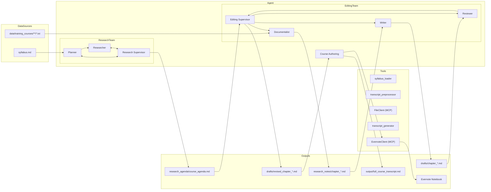

# GenAI Training Transcript Generator - Comprehensive Plan

Below is a proposed plan for standing up your “Gen-AI Training-Session Transcript Generator” use-case, following the same patterns used in the Model-Selection Guide (adaptation-decision-tr) and the research_bot example in experiments/openai-agents/research_bot. I’ve broken it into four parts:

---

## 1. Feature Breakdown

| Feature                            | Description                                                                                                                         |
| ---------------------------------- | ----------------------------------------------------------------------------------------------------------------------------------- |
| **Syllabus Ingestion**             | Load the syllabus (hand-written or Markdown) from local files, or from Evernote.                                                    |
| **Transcript Preprocessing**       | Preprocess raw `.txt` transcripts: add punctuation, paragraph segmentation, chapter markers, and generate metadata (manifest.json). |
| **Knowledge-Base Retrieval (RAG)** | Index & retrieve past transcripts, notebooks, and external web content via Completions API file-search.                             |
| **Transcript Generation**          | Given syllabus outline + retrieved context, use the Completions API to generate session transcripts in a specified “style.”         |
| **Evernote Export**                | Push the generated transcript back into Evernote (new note in a given notebook).                                                    |
| **End-to-End Agent Workflow**      | Wire the above steps into a single Agents-SDK agent, orchestrating ingestion → retrieval → generation → export.                     |

---

## 2. User Stories & Acceptance Criteria

### A0. Transcript Preprocessing

**User Story**  
As a course author, I want to preprocess raw `.txt` transcripts to add punctuation, paragraph segmentation, chapter markers, and generate metadata, so that our knowledge base is formatted and indexed.

**Acceptance Tests**

1. Given a folder `data/training_courses/*.txt`, the preprocessor generates formatted Markdown files `data/training_courses/*.md` with punctuation and paragraph breaks.
2. The tool produces a `manifest.json` capturing metadata (course title, date, topics) for each transcript file.

### A. Syllabus Ingestion

**User Story**  
As a course author, I want to point the agent at a local Markdown syllabus (or an Evernote note containing the syllabus), so that the agent can read my course outline automatically.

**Acceptance Tests**

1. Given a path to `syllabus.md`, the agent confirms it can read and parse the session titles and description bullets.
2. Given an Evernote note-URL (or note-ID), the agent fetches that note’s plain-text content and parses it as Markdown.

---

### B. Knowledge-Base Retrieval

**User Story**  
As a course author, I want the agent to automatically look up past session transcripts and related notebooks so that it can ground the new transcript in real examples.

**Acceptance Tests**

1. Local transcripts under `data/transcripts/*.md` are indexed via the Completions API file-search endpoint, and relevant contexts are retrieved for each syllabus section.
2. If a “web sources” flag is set, the agent can also pull in designated URLs (we’ll stub these for now).

---

### C. Transcript Generation

**User Story**  
As a course author, I want the agent to generate a full session transcript for each module in my syllabus, following a consistent style (“interview-style Q&A,” or “lecture narrative,” etc.).

**Acceptance Tests**

1. Given a small syllabus outline of 2 sessions and a repository of 5 prior training transcripts, the agent produces 2 Markdown files (`session_1.md`, `session_2.md`) whose content:
   - Respects the syllabus headings.
   - References the RAG-pulled context (e.g. quotes past examples).
   - Exhibits the chosen style.
2. The generation calls only the Agents SDK + Completions API (no other LLM calls).

---

### D. Evernote Export

**User Story**  
As a course author, I want the newly generated transcripts automatically saved back to Evernote so I don’t have to copy/paste them manually.

**Acceptance Tests**

1. Given valid Evernote API credentials (or personal token), the agent creates a new note in a target notebook.
2. The note’s title matches `GenAI Session Transcript – <module title>`.
3. The note body is the Markdown transcript text.

---

## 3. Component & Code-Structure Plan

Below is a sketch of where code and tests could live, following the research_bot pattern:

```
.
├── examples/
│   └── genai_training_transcript/        # your new example
│       ├── agent.py                     # Agents-SDK orchestration
│       ├── tools/
│       │   ├── syllabus_loader.py       # load local MD / Evernote note
│       │   ├── transcript_preprocessor.py# format raw .txt transcripts, split chapters, metadata
│       │   ├── rag_retriever.py         # wrap Completions file-search
│       │   ├── transcript_generator.py  # wraps Completions API calls
│       │   └── evernote_exporter.py     # small “MCP”‐style integration
│       ├── config.yaml                  # notebook IDs, style settings, paths
│       └── run.py                       # CLI entrypoint for the workflow
├── docs/
│   └── genai_training_transcript.md     # high-level README for the example
└── tests/
    └── test_genai_transcript.py         # end-to-end smoke/integration tests
```

**Notes on key pieces:**

| File                           | Responsibility                                                                                                                           |
| ------------------------------ | ---------------------------------------------------------------------------------------------------------------------------------------- |
| **syllabus_loader.py**         | Detect if input path is `.md` (local) vs. `evernote://<note-id>`, then fetch & parse Markdown.                                           |
| **rag_retriever.py**           | Use Agents SDK’s `FileSearch` tool (Completions API) to index `data/transcripts/*.md` and retrieve relevant context for each session.    |
| **transcript_preprocessor.py** | Preprocess raw `.txt` transcript files into formatted Markdown, split into chapters, and emit a manifest.json metadata file.             |
| **transcript_generator.py**    | Given syllabus outline + RAG context + style prompt, call Completions API `chat.completions` to generate the transcript.                 |
| **evernote_exporter.py**       | A tiny Evernote client implemented as an “MCP‐style provider” (or simply a tool) that uses the Evernote HTTP API or CLI to create notes. |
| **agent.py**                   | Wire all the above tools into a single Agents SDK agent with a task plan: load → retrieve → generate → export.                           |
| **run.py**                     | Thin CLI wrapper for user to kick off the workflow, passing in syllabus path, target notebook, style tag, etc.                           |

---

## 4. Integration-and-Adaptation Guidance

0. **Transcript Preprocessing**  
   Implement a standalone preprocessing tool (`transcript_preprocessor.py`) to format raw `.txt` transcripts, split into chapters, and emit `manifest.json` metadata prior to ingestion.

1. **Agents SDK Orchestration**  
   Register each component (syllabus_loader, FileClient, transcript_generator, evernote_exporter) as an Agents SDK Tool and define an agentic workflow plan that sequences: load → retrieve → generate → export.

2. **Follow the Model-Selection Guide pattern** (see adaptation-decision-tr):

   - Decide upfront: all LLM calls should be via the Completions API + FileSearch (RAG).
   - Avoid mixing other LLM endpoints.
   - Bake in configuration-driven style selection.

3. **MCP-style for Evernote**  
   There isn’t an “official” Evernote MCP, so treat Evernote like any other external tool:

   - Write a minimal Python wrapper (`evernote_exporter.py`) that exposes `create_note(title, body, notebook_id)`.
   - Register it as a tool in your Agents SDK agent.
   - Mock it in your tests so you don’t hit the real Evernote API during CI.

4. **Tests & CI**

   - Unit-test each tool in isolation (syllabus parsing, RAG retrieval stubbing file-search responses, generation prompt formatting, Evernote exporter).
   - Add one end-to-end smoke test in `tests/test_genai_transcript.py` that runs against local sample files + a mock Evernote.

5. **Documentation**

   - In `docs/genai_training_transcript.md`, describe the workflow, prerequisites (Evernote API token, local transcripts folder), example commands, and expected outputs.
   - Link to that doc from the root README or a “Cookbook” index so people can discover it.

6. **Configuration-driven parameters**
   Create a configuration file (e.g. `config.yaml`) to define agent parameters such as chunk size, max revisions/iteration budgets, metadata filters (e.g. folder name patterns), and retrieval settings.

---

## Mid-Term Vision & Hierarchical Agent Team

To support more complex course authoring workflows, we will adopt a hierarchical, multi-agent pattern inspired by `app/video_script/assistant.py`, orchestrated via the Agents SDK StateGraph (no LangGraph). The workflow is divided into two subteams—Research Team and Editing Team—each overseen by its own Supervisor, plus a final Course Authoring Agent for global quality assurance:

| Stage                   | Role                            | Responsibilities                                                                                                                                                                                                          |
| ----------------------- | ------------------------------- | ------------------------------------------------------------------------------------------------------------------------------------------------------------------------------------------------------------------------- |
| **Research Team**       | Planner, Researcher             | Ingest syllabus; refine session outline (titles, bullets, objectives); lookup cross-course content via metadata/folder patterns; produce a detailed course agenda (`research_agenda/course_agenda.md`).                   |
| **Research Supervisor** | Research Supervisor             | Monitor the Research Team’s iteration budget and ensure agenda completeness                                                                                                                                               |
| **Editing Team**        | Documentalist, Writer, Reviewer | For each chapter (parallelizable):<br>• _Documentalist_: retrieve detailed content based on agenda queries<br>• _Writer_: draft chapter transcript following style guidelines<br>• _Reviewer_: provide feedback on drafts |
| **Editing Supervisor**  | Editing Supervisor              | Enforce iteration limits for the Editing Team and maintain cost efficiency                                                                                                                                                |
| **Course Authoring**    | Course Authoring Agent          | Perform a global QA pass across all approved chapters: stitch chapters, ensure smooth transitions, avoid repetition, and cover all syllabus objectives                                                                    |

## Retrieval & Context-Management Strategy

1. **Early-stage (v1): Simple FileClient MCP**  
   Load all local transcripts under `data/training_courses/...` via a FileClient tool and persist chapter-level research notes (`research_notes/*.md`).

2. **Mid-stage (v2): Completions API File-Search (RAG)**  
   Index course content using the Completions API file-search endpoint for relevance-based retrieval, without rebuilding local indices.

3. **Longer-term (v3+): Summary Indices & Metadata**  
   Generate a `manifest.json` via a dedicated agent to capture course metadata (title, level, tags). Build summary indices (e.g. with LlamaIndex) for late-chunked retrieval and faster filtering.

## Short-Term Execution Plan (Sprints)

| Sprint                | Goal & Description                                                                          | Key Tasks                                                                                                                                                                                                                                                                                                         |
| --------------------- | ------------------------------------------------------------------------------------------- | ----------------------------------------------------------------------------------------------------------------------------------------------------------------------------------------------------------------------------------------------------------------------------------------------------------------- |
| **Sprint 1 (MVP v1)** | Scaffold & basic workflow with FileClient (no RAG/MCP), including transcript preprocessing. | • Preprocess raw `.txt` transcripts into `.md` + manifest.json (US0)<br>• Ingest syllabus `.md`<br>• Load preprocessed transcripts via FileClient<br>• Run Planning Team→Editing Team→Supervisors→Course Authoring<br>• Persist `research_agenda/`, `research_notes/`, `drafts/`, and per-chapter `output/` files |
| **Sprint 2 (MVP v2)** | Swap FileClient for Completions API file-search (RAG).                                      | • Index `data/training_courses/**/*.md`<br>• Researcher uses file-search tool<br>• Validate transcript quality vs. v1 output                                                                                                                                                                                      |
| **Sprint 3 (MVP v3)** | Summary indices & manifest metadata for cross-course retrieval.                             | • Agent generates `manifest.json` for each course<br>• Implement summary-index & vector-store tool<br>• Enable metadata-based filtering                                                                                                                                                                           |
| **Sprint 4 (MCP v1)** | Evernote integration for syllabus import & transcript export.                               | • Build Evernote MCP client<br>• Integrate import/export into agentic workflow                                                                                                                                                                                                                                    |
| **Sprint 5+**         | Global quality pass & refinements (dedupe, CLI flags, advanced styling).                    | • Final flow-and-style agent<br>• CLI configuration options<br>• Additional enhancements                                                                                                                                                                                                                          |

---

### Next Steps

1. **Validate this mid-term architecture and sprint plan** and refine as needed.
2. **Incorporate any final feedback** before implementation.
3. **Kick off Sprint 1**: scaffold the example directory and stub out the Planner and FileClient tools.
4. **Run pre-commit / tests**, iterate.

## 5. High-Level Architecture Diagram


