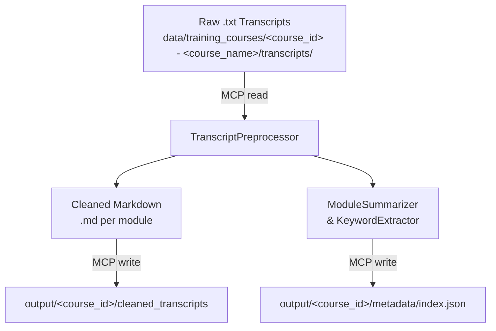

# Plan: Training Course Manager (US0)

## 1. Context and Objectives
- The Training Course Manager preprocesses and indexes raw training course materials to enable fast retrieval and late-chunking workflows.
- Focus on cleaning `.txt` transcripts into paragraph‑segmented Markdown and generating a metadata index for modules.
- Use the MCP filesystem protocol over stdio (e.g. via `npx @modelcontextprotocol/server-filesystem`) for all file I/O to support swappable storage backends (e.g. local disk, Evernote).
- No vector databases or embedding generation in this iteration; downstream retrieval and chunking are handled by separate modules.

## 2. Scope

### In Scope
- Course directory naming: `data/training_courses/<course_id> - <course_name>/`
- Raw transcripts (`.txt`) under `data/training_courses/<course_id> - <course_name>/transcripts/`, following filename pattern `<course_id>_<module_index>_<language> - <course_name> - <module_index> - <module_name>.txt`
- Output: cleaned Markdown files per module and a JSON metadata index

### Out of Scope
- Notebooks (`.ipynb`), aggregated PDFs, slide decks, and `.vtt` files (slated for 2nd iteration enhancements)
- Embedding or vector-database ingestion
- Downstream retrieval, search, or chunking logic

## 3. User Story US0
**As** a content engineer  
**I want** to preprocess raw `.txt` training transcripts into cleaned, paragraph‑segmented module files and generate a metadata index  
**So that** the research team can quickly lookup modules by keyword and perform late chunking on coherent content segments.

### Acceptance Criteria
1. All raw `.txt` files under `data/training_courses/<course_id> - <course_name>/transcripts/` are read via the MCP filesystem protocol. Raw transcript filenames must follow `<course_id>_<module_index>_<language> - <course_name> - <module_index> - <module_name>.txt`.
2. For each module transcript, produce a cleaned Markdown file (`.md`) with correct punctuation, sentence boundaries, and paragraph segmentation.
3. Generate a JSON index file per course at `output/<course_id>/metadata/index.json` with the schema:
```json
{
  "course_id": "string",
  "course_title": "string",
  "modules": [
    {
      "module_id": "string",
      "title": "string",
      "summary": "string",
      "keywords": ["string"],
      "tags": ["string"]
    }
  ]
}
```
4. Write cleaned transcripts to `output/<course_id>/cleaned_transcripts/<module_id>.md` and the index file via the MCP filesystem protocol.
5. The file hierarchy clearly conveys course and module boundaries to allow interchangeable storage backends.

### Implementation Notes
- **Transcript Preprocessor**: Use an LLM-based correction pipeline to add proper punctuation, fix sentence boundaries, resolve automatic translation or spelling errors, and preserve semantic meaning in transcripts.
- **Metadata Extraction**: Use an LLM to generate concise module summaries and detect both topic-specific keywords (e.g., “distractor” for RAG modules) and higher-level tags to facilitate quick topic access.

## 4. Architecture Diagram


## 5. File Hierarchy
**Module filename pattern**: `<course_id>_<module_index>_<language> - <course_name> - <module_index> - <module_name>.md`
**Raw transcript filename pattern**: `<course_id>_<module_index>_<language> - <course_name> - <module_index> - <module_name>.txt`

```mermaid
%% File hierarchy for US0 outputs
graph TD
    root[/output/]/--> course[&lt;course_id&gt;/]
    course --> ct[cleaned_transcripts/]
    course --> md[metadata/]
    ct --> m1[&lt;module_id&gt;.md]
    ct --> m2[&lt;module_id&gt;.md]
    md --> index[index.json]
```

## 6. Future Extensions
- Support `.vtt` and slide decks cleanup
- Ingest notebooks (`.ipynb`) and aggregated PDFs; detect module-notebook associations and index notebook content
- Additional content sources (YouTube transcripts, Evernote) via MCP

## 7. CLI Usage
```bash
poetry run run_training_manager \
  --course-path <path/to/data/training_courses/<course_id> - <course_name>> \
  [--mcp-endpoint <uri>] [--overwrite]
```
- `--course-path`: Path to the course directory (e.g. `data/training_courses/<course_id> - <course_name>`).
- `--mcp-endpoint`: URI for the MCP filesystem server (e.g. `stdio://` or `evernote://...`). If omitted, inferred from `MCP_ENDPOINT` environment variable or defaults to `stdio://`.
- `--overwrite`: Overwrite existing cleaned transcripts and metadata files; by default, skip modules or metadata entries that already exist to save time.
- Original source files (`.txt`) are never modified or deleted.

## 8. MCP Helper Methods Specification

### User Story US0-MCP
**As** a developer integrating with MCP filesystem protocols  
**I want** abstracted file I/O operations with local fallbacks  
**So that** the training manager works with both MCP servers and local filesystem without code duplication.

### MCP Helper Methods
The training manager implements the following async helper methods to abstract MCP operations:

#### `_ensure_directories_exist(mcp_server: MCPServer, directories: list[str]) -> None`
- **Purpose**: Create output directories using MCP protocol with local fallback
- **Behavior**: Creates directories recursively if they don't exist
- **Fallback**: Uses `os.makedirs()` when MCP directory creation is unavailable
- **Error Handling**: Continues silently if directories already exist

#### `_list_transcript_files(mcp_server: MCPServer, transcripts_dir: str) -> list[str]`
- **Purpose**: List transcript files in directory via MCP with local fallback
- **Behavior**: Returns sorted list of `.txt` files only
- **Fallback**: Uses `os.listdir()` when MCP file listing is unavailable
- **Error Handling**: Returns empty list if directory doesn't exist or MCP fails

#### `_file_exists(mcp_server: MCPServer, file_path: str) -> bool`
- **Purpose**: Check file existence via MCP with local fallback
- **Behavior**: Returns boolean indicating file existence
- **Fallback**: Uses `os.path.exists()` when MCP existence check is unavailable
- **Error Handling**: Returns `False` for any exceptions

#### `_read_file(mcp_server: MCPServer, file_path: str) -> str`
- **Purpose**: Read file content via MCP with local fallback  
- **Behavior**: Returns file content as UTF-8 string
- **Fallback**: Uses standard `open()` when MCP reading is unavailable
- **Error Handling**: Raises exception on read errors for proper error propagation

#### `_write_file(mcp_server: MCPServer, file_path: str, content: str) -> None`
- **Purpose**: Write file content via MCP with local fallback
- **Behavior**: Writes UTF-8 encoded content to file
- **Fallback**: Uses standard `open()` when MCP writing is unavailable  
- **Error Handling**: Raises exception on write errors for proper error propagation

### Implementation Requirements
1. **Local Fallback**: All methods must work with local filesystem when MCP is unavailable
2. **Async Pattern**: All methods are async to support future MCP integration
3. **Error Transparency**: File I/O errors should propagate to caller for proper handling
4. **UTF-8 Encoding**: All text operations use UTF-8 encoding for consistency
5. **Unit Testing**: Full test coverage with mock MCP servers and error scenarios

## 9. Single-File Course Support Specification

### User Story US0-SingleFile
**As** a content engineer  
**I want** to process single `.txt` transcript files directly (not in a directory structure)  
**So that** I can handle simple courses without creating complex directory hierarchies.

### Acceptance Criteria
1. **File Detection**: Training manager automatically detects if `--course-path` points to a `.txt` file vs. directory
2. **Single File Processing**: Direct `.txt` files are processed as single-module courses
3. **Course ID Extraction**: Course ID derived from filename (without extension)
4. **Title Generation**: Course title generated from filename (underscores → spaces)
5. **Output Consistency**: Same output structure as multi-module courses in `output/<course_id>/`
6. **Error Handling**: Proper error messages for invalid file types or missing files

### Course Structure Support

#### Multi-Module Courses (Existing)
```
data/training_courses/COURSE001 - Advanced AI/
└── transcripts/
    ├── module1.txt
    ├── module2.txt
    └── module3.txt
```

#### Single-File Courses (New)
```
data/training_courses/
└── Advanced_AI_Course.txt
```

### Processing Methods

#### `_process_single_file_course(course_path: str) -> tuple[str, str, list[dict], str]`
- **Purpose**: Process a single `.txt` file as a complete course
- **Input**: Path to `.txt` file (e.g., `"Advanced_AI_Course.txt"`)
- **Returns**: `(course_id, course_title, modules, transcripts_dir)`
  - `course_id`: Filename without extension (`"Advanced_AI_Course"`)
  - `course_title`: Readable title (`"Advanced AI Course"`)
  - `modules`: List with single module dict containing filepath info
  - `transcripts_dir`: Parent directory of the file
- **Behavior**: Creates module metadata for single file processing

#### `_process_directory_course(course_path: str) -> tuple[str, str, list[str], str]`
- **Purpose**: Process traditional multi-module directory structure
- **Input**: Path to course directory (e.g., `"COURSE001 - Advanced AI"`)
- **Returns**: `(course_id, course_title, modules, transcripts_dir)`
  - `course_id`: Extracted from directory name (`"COURSE001"`)
  - `course_title`: Extracted from directory name (`"Advanced AI"`)
  - `modules`: List of transcript filenames
  - `transcripts_dir`: Path to transcripts subdirectory
- **Error Handling**: Validates transcripts directory exists and contains `.txt` files

### Implementation Requirements
1. **Automatic Detection**: Use `os.path.isfile()` and `.endswith(".txt")` for file detection
2. **Unified Processing**: Both methods feed into the same processing pipeline
3. **Consistent Output**: Both structures generate identical output format
4. **Error Handling**: Clear error messages for missing files/directories
5. **Unit Testing**: Full test coverage for both processing methods with edge cases

