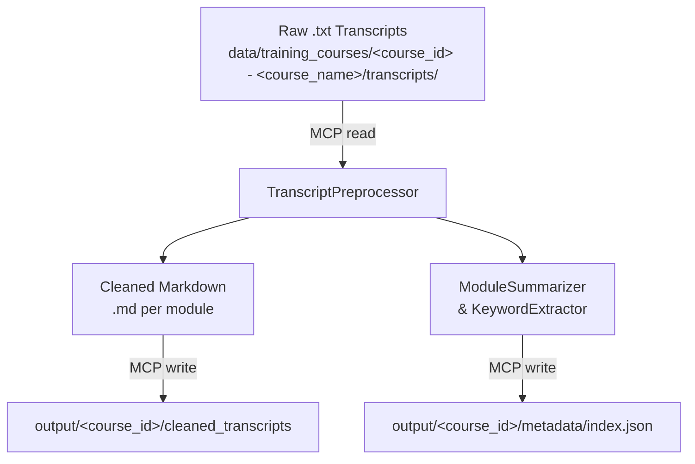

# Plan: Training Course Manager (US0)

## 1. Context and Objectives
- The Training Course Manager preprocesses and indexes raw training course materials to enable fast retrieval and late-chunking workflows.
- Focus on cleaning `.txt` transcripts into paragraph‑segmented Markdown and generating a metadata index for modules.
- Use the MCP filesystem protocol over stdio (e.g. via `npx @modelcontextprotocol/server-filesystem`) for all file I/O to support swappable storage backends (e.g. local disk, Evernote).
- No vector databases or embedding generation in this iteration; downstream retrieval and chunking are handled by separate modules.

## 2. Scope

### In Scope
- Course directory naming: `data/training_courses/<course_id> - <course_name>/`
- Raw transcripts (`.txt`) under `data/training_courses/<course_id> - <course_name>/transcripts/`, following filename pattern `<course_id>_<module_index>_<language> - <course_name> - <module_index> - <module_name>.txt`
- Output: cleaned Markdown files per module and a JSON metadata index

### Out of Scope
- Notebooks (`.ipynb`), aggregated PDFs, slide decks, and `.vtt` files (slated for 2nd iteration enhancements)
- Embedding or vector-database ingestion
- Downstream retrieval, search, or chunking logic

## 3. User Story US0
**As** a content engineer  
**I want** to preprocess raw `.txt` training transcripts into cleaned, paragraph‑segmented module files and generate a metadata index  
**So that** the research team can quickly lookup modules by keyword and perform late chunking on coherent content segments.

### Acceptance Criteria
1. All raw `.txt` files under `data/training_courses/<course_id> - <course_name>/transcripts/` are read via the MCP filesystem protocol. Raw transcript filenames must follow `<course_id>_<module_index>_<language> - <course_name> - <module_index> - <module_name>.txt`.
2. For each module transcript, produce a cleaned Markdown file (`.md`) with correct punctuation, sentence boundaries, and paragraph segmentation.
3. Generate a JSON index file per course at `output/<course_id>/metadata/index.json` with the schema:
```json
{
  "course_id": "string",
  "course_title": "string",
  "modules": [
    {
      "module_id": "string",
      "title": "string",
      "summary": "string",
      "keywords": ["string"],
      "tags": ["string"]
    }
  ]
}
```
4. Write cleaned transcripts to `output/<course_id>/cleaned_transcripts/<module_id>.md` and the index file via the MCP filesystem protocol.
5. The file hierarchy clearly conveys course and module boundaries to allow interchangeable storage backends.

### Implementation Notes
- **Transcript Preprocessor**: Use an LLM-based correction pipeline to add proper punctuation, fix sentence boundaries, resolve automatic translation or spelling errors, and preserve semantic meaning in transcripts.
- **Metadata Extraction**: Use an LLM to generate concise module summaries and detect both topic-specific keywords (e.g., “distractor” for RAG modules) and higher-level tags to facilitate quick topic access.

## 4. Architecture Diagram


## 5. File Hierarchy
**Module filename pattern**: `<course_id>_<module_index>_<language> - <course_name> - <module_index> - <module_name>.md`
**Raw transcript filename pattern**: `<course_id>_<module_index>_<language> - <course_name> - <module_index> - <module_name>.txt`

```mermaid
%% File hierarchy for US0 outputs
graph TD
    root[/output/]/--> course[&lt;course_id&gt;/]
    course --> ct[cleaned_transcripts/]
    course --> md[metadata/]
    ct --> m1[&lt;module_id&gt;.md]
    ct --> m2[&lt;module_id&gt;.md]
    md --> index[index.json]
```

## 6. Future Extensions
- Support `.vtt` and slide decks cleanup
- Ingest notebooks (`.ipynb`) and aggregated PDFs; detect module-notebook associations and index notebook content
- Additional content sources (YouTube transcripts, Evernote) via MCP

## 7. CLI Usage
```bash
poetry run run_training_manager \
  --course-path <path/to/data/training_courses/<course_id> - <course_name>> \
  [--mcp-endpoint <uri>] [--overwrite]
```
- `--course-path`: Path to the course directory (e.g. `data/training_courses/<course_id> - <course_name>`).
- `--mcp-endpoint`: URI for the MCP filesystem server (e.g. `stdio://` or `evernote://...`). If omitted, inferred from `MCP_ENDPOINT` environment variable or defaults to `stdio://`.
- `--overwrite`: Overwrite existing cleaned transcripts and metadata files; by default, skip modules or metadata entries that already exist to save time.
- Original source files (`.txt`) are never modified or deleted.