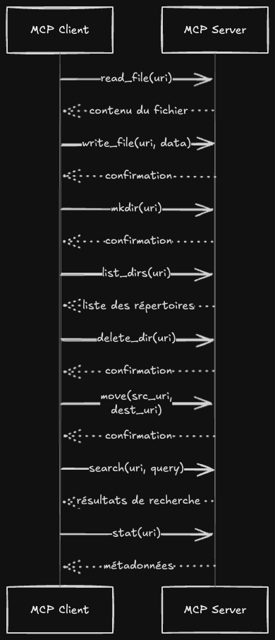
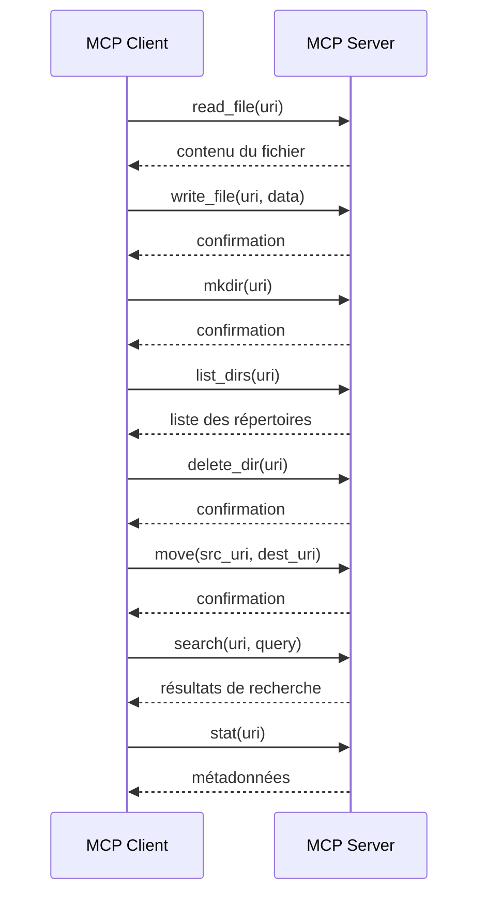

# Plan d’actions : client/serveur Evernote via MCP Filesystem

## 1. Contexte et objectifs

- Créer un client/serveur MCP pour Evernote, exposant la même API que le MCP Filesystem.
- Couvrir pour tout type de contenu (syllabus, transcripts, guidelines de style, etc.) les fonctionnalités de base du MCP Filesystem :
  - lecture/écriture de fichiers,
  - création / listing / suppression de répertoires,
  - déplacement de fichiers et répertoires.
- Prendre en charge la recherche et la récupération de métadonnées de façon optionnelle, selon les besoins du Training Course Generator.
- Permettre un échange transparent de contenu via les schémas d’URI `file://` et `evernote://`.

## 2. Fonctionnalités ciblées (MCP Filesystem & Evernote)

- Lecture de fichiers (`read_file`)
- Écriture de fichiers (`write_file`)
- Création / listing / suppression de répertoires (`mkdir`, `list_dirs`, `delete_dir`)
- Déplacement de fichiers et répertoires (`move`)
- Recherche de fichiers (`search`)
- Récupération des métadonnées (`stat`)

## 3. User Stories

| ID       | Rôle      | Fonctionnalité                                         | Valeur métier                      |
| -------- | --------- | ------------------------------------------------------ | ---------------------------------- |
| US-MCP-1 | Client AI | Charger un document via `file://` ou `evernote://`     | Accéder au contenu pour traitement |
| US-MCP-2 | Client AI | Enregistrer un document via `file://` ou `evernote://` | Sauvegarder les mises à jour       |
| US-MCP-3 | Client AI | Lister les dossiers dans un URI donné                  | Naviguer dans la structure         |
| US-MCP-4 | Client AI | Rechercher des documents par mot-clé                   | Retrouver rapidement du contenu    |
| US-MCP-5 | Client AI | Récupérer les métadonnées d’un document                | Afficher date de création, taille  |

## 4. Architecture et points d’entrée

- Diagramme de séquence haute-niveau : MCP Client ↔ MCP Server

- Interfaces exposées par le serveur (mêmes signatures que le MCP Filesystem existant)
- Factory basée sur URI pour instancier un client `file://` ou `evernote://`

## 5. Mapping MCP Filesystem → Evernote SDK (Python)

| MCP Filesystem Method     | Evernote SDK (Python)                              | Remarques                             |
| ------------------------- | -------------------------------------------------- | ------------------------------------- |
| `read_file(uri)`          | `note_store.getNoteContent(guid)`                  | `evernote://<notebook>/<note>` → GUID |
| `write_file(uri, data)`   | `note_store.updateNote(...)`                       |                                       |
| `mkdir(uri)`              | `note_store.createNotebook(...)`                   | Notebook Evernote                     |
| `list_dirs(uri)`          | `note_store.listNotebooks()` / `findNotesMetadata` |                                       |
| `delete_dir(uri)`         | `note_store.expungeNotebook(...)`                  |                                       |
| `move(src_uri, dest_uri)` | expunge + create ou updateNote                     |                                       |
| `search(uri, query)`      | `note_store.findNotesMetadata(...)`                |                                       |
| `stat(uri)`               | `note_store.getNoteMetadata(...)`                  |                                       |

## 6. Itération 1 : adapter MCP Filesystem (baseline)

- Mettre en place un serveur MCP Filesystem minimal (filesystem local)
- Implémenter les User Stories en utilisant le filesystem local
- Écrire des tests unitaires pour chaque méthode (read, write, mkdir, list, move, search, stat)

## 7. Itération 2 : intégration de l’API Evernote

- Basculer l’implémentation serveur sur le SDK Python Evernote
- Adapter la factory pour instancier le client Evernote
- Tests d’intégration sur sandbox Evernote

## 8. Références

- Code MCP Filesystem : https://github.com/modelcontextprotocol/servers/tree/main/src/filesystem
- Documentation Evernote API : https://dev.evernote.com/doc/
