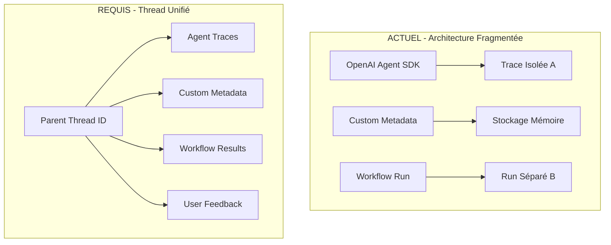

# Plan d'Action : LangSmith Thread Management et User Feedback Automatique

## Contexte et Problème Identifié

### Problèmes Actuels
1. **Métadonnées non liées** : Les métadonnées custom sont stockées en mémoire sans être envoyées à LangSmith
2. **Traces isolées** : Chaque agent crée une trace séparée sans thread parent unifié
3. **Pas de feedback automatique** : Absence d'évaluation LLM-as-judge pour générer des datasets d'entraînement
4. **Architecture fragmentée** : Pas de corrélation entre traces d'agents SDK et métadonnées custom

### Gap Architectural Critique


## Plan d'Action Détaillé - PRIORITÉS RÉVISÉES

### Phase 1 : Thread Management + Remontée Métadonnées par Bloc (Priorité CRITIQUE)

#### Tâche 1.1 : Créer LangSmithThreadManager
**Fichier** : `src/evaluation/langsmith_thread_manager.py`

```python
"""
LangSmith Thread Management pour regroupement unified des traces multi-agents.
"""
import asyncio
import logging
from datetime import datetime
from typing import Any, Dict, List, Optional
from uuid import uuid4

from langsmith import Client as LangSmithClient
from agents import set_trace_processors
from langsmith.wrappers import OpenAIAgentsTracingProcessor

logger = logging.getLogger(__name__)

class LangSmithThreadManager:
    """
    Gestionnaire de threads LangSmith pour regrouper toutes les traces et métadonnées
    d'un workflow multi-agents sous un thread parent unifié.
    """
    
    def __init__(self, project_name: str = "story-ops", api_key: str | None = None):
        self.project_name = project_name
        self.client = LangSmithClient(api_key=api_key)
        self.current_thread_id: str | None = None
        self.metadata_buffer: List[Dict[str, Any]] = []
        
    async def create_workflow_thread(self, 
                                   workflow_name: str,
                                   initial_metadata: Dict[str, Any]) -> str:
        """
        Créer un thread parent pour tout le workflow multi-agents.
        
        Returns:
            Thread ID pour référence par tous les agents
        """
        thread_id = str(uuid4())
        thread_name = f"{workflow_name}-{datetime.now().strftime('%Y%m%d-%H%M%S')}"
        
        # Créer thread parent dans LangSmith
        thread_run = await asyncio.to_thread(
            self.client.create_run,
            name=thread_name,
            run_type="chain",
            project_name=self.project_name,
            inputs={"workflow_type": workflow_name, "metadata": initial_metadata},
            extra={"thread_id": thread_id, "is_parent_thread": True}
        )
        
        self.current_thread_id = thread_run.id
        
        # Configurer Agent SDK tracing avec parent thread
        self._configure_agent_tracing(self.current_thread_id)
        
        logger.info(f"Thread créé: {thread_name} (ID: {self.current_thread_id})")
        return self.current_thread_id
    
    def _configure_agent_tracing(self, parent_thread_id: str):
        """Configure Agent SDK pour utiliser le thread parent"""
        set_trace_processors([
            OpenAIAgentsTracingProcessor(
                parent_run_id=parent_thread_id,
                project_name=self.project_name
            )
        ])
    
    async def attach_phase_metadata(self, 
                                   phase: str,
                                   phase_results: Dict[str, Any],
                                   agent_name: str) -> bool:
        """
        Attacher métadonnées d'une phase complète au thread parent.
        GARANTIT la livraison avant arrêt application.
        
        Args:
            phase: Phase du workflow (research, editing, finalization)
            phase_results: Résultats complets de la phase
            agent_name: Nom de l'agent responsable de la phase
        """
        if not self.current_thread_id:
            logger.error("Aucun thread actif pour attacher les métadonnées")
            return False
        
        try:
            # Structure métadonnées par bloc de phase
            phase_metadata = {
                "phase": phase,
                "agent_name": agent_name,
                "timestamp": datetime.now().isoformat(),
                "results": phase_results,
                "status": "completed"
            }
            
            # Envoi SYNCHRONE simple - on attend que ça parte
            await self.client.update_run(
                run_id=self.current_thread_id,
                extra={f"phase_{phase}": phase_metadata}
            )
            
            logger.info(f"Métadonnées phase attachées: {phase} ({agent_name})")
            return True
            
        except Exception as e:
            logger.error(f"Échec attachment métadonnées phase {phase}: {e}")
            return False
    
    async def finalize_thread(self, final_results: Dict[str, Any]) -> bool:
        """Finaliser le thread avec résultats (simple et synchrone)"""
        if not self.current_thread_id:
            return False
        
        try:
            # Finaliser thread - envoi synchrone
            await self.client.update_run(
                run_id=self.current_thread_id,
                outputs=final_results,
                extra={
                    "finalization_timestamp": datetime.now().isoformat(),
                    "thread_complete": True
                }
            )
            
            logger.info(f"Thread finalisé: {self.current_thread_id}")
            return True
            
        except Exception as e:
            logger.error(f"Échec finalisation thread: {e}")
            return False
```

**Conditions d'Acceptation Techniques** :
- [ ] Thread parent créé avant démarrage de tout agent
- [ ] Agent SDK configuré avec `parent_run_id` correct  
- [ ] Métadonnées par bloc (research, editing, finalization) envoyées **synchrone**
- [ ] Chaque phase attachée avec métadonnées structurées
- [ ] Thread finalisé avec résultats complets

**Conditions d'Acceptation Fonctionnelles** :
- [ ] LangSmith UI montre 3 blocs distincts : phase_research, phase_editing, phase_finalization
- [ ] Métadonnées par phase visibles et navigables
- [ ] Traces d'agents regroupées sous thread parent
- [ ] Navigation hiérarchique : Thread → Phases → Agent traces

#### Tâche 1.2 : Intégrer ThreadManager dans WorkflowOrchestrator
**Fichier** : `src/transcript_generator/workflow_orchestrator.py`

```python
# Modification de la classe WorkflowOrchestrator
class WorkflowOrchestrator:
    def __init__(self, ...):
        # ... existing code ...
        
        # Ajouter ThreadManager
        self.thread_manager = LangSmithThreadManager(
            project_name="story-ops",
            api_key=env_config.langsmith_api_key
        ) if env_config.langsmith_tracing_enabled else None
    
    async def generate_content(self, syllabus_data: dict) -> WorkflowResult:
        thread_id = None
        
        try:
            # Phase 0: Créer thread parent AVANT tous les agents
            if self.thread_manager:
                thread_id = await self.thread_manager.create_workflow_thread(
                    workflow_name="transcript-generation-pipeline",
                    initial_metadata={
                        "syllabus_title": syllabus_data.get("title", "Unknown"),
                        "sections_count": len(syllabus_data.get("sections", [])),
                        "start_time": datetime.now().isoformat()
                    }
                )
                self.logger.info(f"Workflow thread créé: {thread_id}")
            
            # Phase 1: Research (avec métadonnées par bloc)
            research_notes = await self._orchestrate_research_phase(syllabus_data)
            if self.thread_manager and research_notes:
                research_metadata = {
                    "modules_researched": list(research_notes.keys()),
                    "total_sources": sum(len(notes.get("sources", [])) for notes in research_notes.values()),
                    "research_quality_score": self._calculate_research_quality(research_notes),
                    "coverage_analysis": self._analyze_syllabus_coverage(research_notes, syllabus_data)
                }
                await self.thread_manager.attach_phase_metadata(
                    phase="research",
                    phase_results=research_metadata,
                    agent_name="research_team"
                )
            
            # Phase 2: Editing (avec métadonnées par bloc)
            chapter_drafts = await self._orchestrate_editing_phase(research_notes, syllabus_data)
            if self.thread_manager and chapter_drafts:
                editing_metadata = {
                    "chapters_generated": len(chapter_drafts),
                    "total_word_count": sum(len(draft.content.split()) for draft in chapter_drafts),
                    "narrative_coherence_score": self._assess_narrative_coherence(chapter_drafts),
                    "syllabus_alignment": self._check_syllabus_alignment(chapter_drafts, syllabus_data)
                }
                await self.thread_manager.attach_phase_metadata(
                    phase="editing",
                    phase_results=editing_metadata,
                    agent_name="editing_team"
                )
            
            # Phase 3: Finalization (avec métadonnées par bloc)
            final_transcript_path, quality_summary_path = await self._orchestrate_finalization_phase(
                chapter_drafts, syllabus_data
            )
            if self.thread_manager:
                finalization_metadata = {
                    "final_transcript_generated": bool(final_transcript_path),
                    "quality_issues_detected": self._count_quality_issues(quality_summary_path),
                    "final_quality_score": self._extract_final_quality_score(quality_summary_path),
                    "approval_status": self._determine_approval_status(quality_summary_path)
                }
                await self.thread_manager.attach_phase_metadata(
                    phase="finalization", 
                    phase_results=finalization_metadata,
                    agent_name="editorial_finalizer"
                )
            
            # Collecter résultats finaux
            workflow_result = WorkflowResult(...)
            
            # Phase 4: Finaliser thread avec tout (SYNCHRONE - on attend)
            if self.thread_manager:
                await self.thread_manager.finalize_thread(
                    final_results={
                        "success": workflow_result.success,
                        "transcript_path": final_transcript_path,
                        "quality_path": quality_summary_path
                    }
                )
                self.logger.info("Thread finalisé - métadonnées garanties envoyées")
            
            return workflow_result
            
        except Exception as e:
            # En cas d'erreur, finaliser thread avec erreur (simple)
            if self.thread_manager and thread_id:
                await self.thread_manager.finalize_thread(
                    final_results={"error": str(e), "success": False}
                )
            raise
```

### Phase 2 : LLM Judge pour Transcript Final (Priorité MOYENNE - après Phase 1 opérationnelle)

#### Tâche 2.1 : Créer LLMJudgeEvaluator
**Fichier** : `src/evaluation/llm_judge_evaluator.py`

```python
"""
LLM-as-Judge Evaluator pour génération automatique de feedback utilisateur
et création de datasets d'entraînement.
"""
import asyncio
import json
from dataclasses import dataclass
from typing import Any, Dict, List
from openai import AsyncOpenAI

@dataclass
class EvaluationCriteria:
    """Critères d'évaluation pour chaque point de contrôle"""
    name: str
    description: str
    weight: float
    scoring_prompt: str

@dataclass
class EvaluationResult:
    """Résultat d'évaluation avec score et justification"""
    criteria_name: str
    score: float  # 0.0 to 1.0
    justification: str
    confidence: float

class LLMJudgeEvaluator:
    """
    Évaluateur LLM-as-Judge pour feedback automatique multi-points.
    """
    
    def __init__(self, model: str = "gpt-4o-mini"):
        self.client = AsyncOpenAI()
        self.model = model
        
        # Critères d'évaluation UNIQUEMENT pour transcript final
        self.final_transcript_criteria = [
            EvaluationCriteria(
                name="syllabus_alignment",
                description="Alignement avec les objectifs du syllabus d'entrée",
                weight=0.6,
                scoring_prompt="""
                Évaluez de 0 à 1 l'alignement du transcript final avec le syllabus d'entrée:
                - 0.9-1.0: Parfait alignement, tous objectifs d'apprentissage couverts
                - 0.7-0.8: Bon alignement, objectifs principaux atteints
                - 0.5-0.6: Alignement partiel, quelques objectifs manqués
                - 0.3-0.4: Alignement faible, objectifs mal couverts
                - 0.0-0.2: Pas d'alignement, transcript hors-sujet
                """
            ),
            EvaluationCriteria(
                name="coherence_quality",
                description="Cohérence globale du transcript final",
                weight=0.4,
                scoring_prompt="""
                Évaluez de 0 à 1 la cohérence globale du transcript:
                - 0.9-1.0: Excellente cohérence, flow narratif parfait
                - 0.7-0.8: Bonne cohérence, transitions logiques
                - 0.5-0.6: Cohérence acceptable, quelques ruptures mineures
                - 0.3-0.4: Cohérence faible, flow disjoints
                - 0.0-0.2: Incohérent, pas de structure narrative
                """
            )
        ]
    
    async def evaluate_final_transcript(self,
                                      final_transcript: str,
                                      syllabus: Dict[str, Any]) -> List[EvaluationResult]:
        """
        Évaluer UNIQUEMENT le transcript final vs syllabus d'entrée.
        Focus sur cohérence avec le syllabus original.
        """
        results = []
        
        for criteria in self.final_transcript_criteria:
            evaluation_prompt = f"""
            CRITÈRE D'ÉVALUATION: {criteria.name}
            DESCRIPTION: {criteria.description}
            
            {criteria.scoring_prompt}
            
            SYLLABUS D'ENTRÉE ORIGINAL:
            {json.dumps(syllabus, indent=2)}
            
            TRANSCRIPT FINAL GÉNÉRÉ:
            {final_transcript[:3000]}...
            
            Comparez le transcript final avec le syllabus d'entrée et évaluez la cohérence.
            
            Fournissez votre évaluation au format JSON:
            {{
                "score": <float 0.0-1.0>,
                "justification": "<explication détaillée sur l'alignement/cohérence>",
                "confidence": <float 0.0-1.0>
            }}
            """
            
            try:
                response = await self.client.chat.completions.create(
                    model=self.model,
                    messages=[{"role": "user", "content": evaluation_prompt}],
                    response_format={"type": "json_object"}
                )
                
                eval_data = json.loads(response.choices[0].message.content)
                results.append(EvaluationResult(
                    criteria_name=criteria.name,
                    score=eval_data["score"],
                    justification=eval_data["justification"],
                    confidence=eval_data["confidence"]
                ))
                
            except Exception as e:
                # Fallback avec score neutre
                results.append(EvaluationResult(
                    criteria_name=criteria.name,
                    score=0.5,
                    justification=f"Évaluation échouée: {e}",
                    confidence=0.0
                ))
        
        return results
    
    def generate_user_feedback(self, 
                             evaluation_results: List[EvaluationResult]) -> Dict[str, Any]:
        """
        Générer feedback utilisateur automatique basé sur les évaluations.
        Format compatible LangSmith feedback.
        """
        # Calculer score global pondéré (uniquement transcript final)
        total_weighted_score = 0.0
        total_weight = 0.0
        
        for result in evaluation_results:
            criteria = next(c for c in self.final_transcript_criteria 
                          if c.name == result.criteria_name)
            total_weighted_score += result.score * criteria.weight
            total_weight += criteria.weight
        
        overall_score = total_weighted_score / total_weight if total_weight > 0 else 0.5
        
        # Déterminer feedback catégorique
        if overall_score >= 0.8:
            feedback_sentiment = "positive"
            feedback_category = "high_quality"
        elif overall_score >= 0.6:
            feedback_sentiment = "neutral" 
            feedback_category = "acceptable_quality"
        else:
            feedback_sentiment = "negative"
            feedback_category = "needs_improvement"
        
        return {
            "overall_score": overall_score,
            "sentiment": feedback_sentiment,
            "category": feedback_category,
            "detailed_scores": {
                result.criteria_name: {
                    "score": result.score,
                    "justification": result.justification,
                    "confidence": result.confidence
                }
                for result in evaluation_results
            },
            "improvement_recommendations": self._generate_recommendations(evaluation_results),
            "dataset_label": feedback_category  # Pour création dataset
        }
    
    def _generate_recommendations(self, results: List[EvaluationResult]) -> List[str]:
        """Générer recommandations d'amélioration"""
        recommendations = []
        
        for result in results:
            if result.score < 0.6:  # Seuil d'amélioration
                recommendations.append(
                    f"Améliorer {result.criteria_name}: {result.justification}"
                )
        
        return recommendations
```

#### Tâche 2.2 : Intégrer LLMJudge dans le Workflow
**Fichier** : Modifier `src/transcript_generator/workflow_orchestrator.py`

```python
# Dans WorkflowOrchestrator
async def _generate_evaluation_scores(self, workflow_result: WorkflowResult) -> Dict[str, float]:
    """Générer scores d'évaluation automatique avec LLM Judge"""
    if not self.llm_judge:
        return {}
    
    try:
        evaluation_scores = {}
        
        # Évaluer chaque phase
        if workflow_result.research_notes:
            research_eval = await self.llm_judge.evaluate_research_phase(
                workflow_result.research_notes, 
                self.syllabus_data
            )
            evaluation_scores["research"] = research_eval
        
        if workflow_result.chapter_drafts:
            editing_eval = await self.llm_judge.evaluate_editing_phase(
                workflow_result.chapter_drafts,
                self.syllabus_data
            )
            evaluation_scores["editing"] = editing_eval
        
        if workflow_result.final_transcript_path:
            finalization_eval = await self.llm_judge.evaluate_finalization_phase(
                workflow_result.final_transcript_content,
                workflow_result.quality_summary,
                self.syllabus_data
            )
            evaluation_scores["finalization"] = finalization_eval
        
        # Générer feedback utilisateur automatique
        all_evaluations = []
        for phase_evals in evaluation_scores.values():
            all_evaluations.extend(phase_evals)
        
        user_feedback = self.llm_judge.generate_user_feedback(all_evaluations)
        
        # Envoyer feedback à LangSmith
        if self.thread_manager:
            await self._send_feedback_to_langsmith(user_feedback)
        
        return {
            "evaluations": evaluation_scores,
            "user_feedback": user_feedback,
            "overall_score": user_feedback["overall_score"]
        }
        
    except Exception as e:
        self.logger.error(f"Échec génération scores évaluation: {e}")
        return {"error": str(e)}

async def _send_feedback_to_langsmith(self, user_feedback: Dict[str, Any]):
    """Envoyer feedback utilisateur à LangSmith pour dataset"""
    try:
        from langsmith import Client
        client = Client()
        
        # Créer feedback utilisateur automatique
        await asyncio.to_thread(
            client.create_feedback,
            run_id=self.thread_manager.current_thread_id,
            key="automated_quality_assessment",
            score=user_feedback["overall_score"],
            value=user_feedback["sentiment"],
            comment=json.dumps(user_feedback["detailed_scores"]),
            feedback_source_type="api"  # Feedback automatique
        )
        
        self.logger.info(f"Feedback automatique envoyé: {user_feedback['sentiment']}")
        
    except Exception as e:
        self.logger.error(f"Échec envoi feedback: {e}")
```

### Phase 3 : Online Evaluations sur Thread (Priorité BASSE - après validation LLM Judge)

#### Tâche 3.1 : Configurer Online Evaluations LangSmith
**Fichier** : `src/evaluation/online_evaluations.py`

```python
"""
Configuration des évaluations online LangSmith avec LLM-as-Judge.
"""
from langsmith.evaluation import LangChainStringEvaluator
from langsmith import Client

class OnlineEvaluationManager:
    """Gestionnaire d'évaluations online pour LangSmith"""
    
    def __init__(self, project_name: str = "story-ops"):
        self.client = Client()
        self.project_name = project_name
        
        # Configurer évaluateurs LLM-as-Judge
        self.evaluators = {
            "quality_judge": LangChainStringEvaluator(
                evaluation_name="transcript-quality-judge",
                llm_or_chain_factory=self._create_quality_judge_chain,
                criteria="Évaluer la qualité pédagogique du transcript généré"
            ),
            "alignment_judge": LangChainStringEvaluator(
                evaluation_name="syllabus-alignment-judge", 
                llm_or_chain_factory=self._create_alignment_judge_chain,
                criteria="Évaluer l'alignement avec les objectifs du syllabus"
            )
        }
    
    def configure_online_evaluations(self):
        """Configure automatic online evaluations for the project"""
        try:
            # Configuration évaluations online
            evaluation_config = {
                "project_name": self.project_name,
                "evaluators": list(self.evaluators.keys()),
                "sampling_rate": 1.0,  # Évaluer 100% des runs
                "async_evaluation": True,
                "create_dataset": True  # Créer dataset automatiquement
            }
            
            # Activer évaluations online via API LangSmith
            # Cette configuration sera appliquée automatiquement
            
            return evaluation_config
            
        except Exception as e:
            logger.error(f"Échec configuration évaluations online: {e}")
            return None
```

## Conditions d'Acceptation Globales

### Techniques
- [ ] Thread parent créé avant tout agent et récupération ID
- [ ] Toutes les traces d'agents liées au thread parent via `parent_run_id`
- [ ] Métadonnées custom envoyées immédiatement (pas de buffer mémoire)
- [ ] Thread finalisé avec résultats complets et scores évaluation
- [ ] LLM Judge évalue 3 phases (research, editing, finalization)
- [ ] Feedback utilisateur automatique généré et envoyé à LangSmith
- [ ] Online evaluations configurées avec LLM-as-Judge

### Fonctionnelles  
- [ ] Interface LangSmith montre thread unifié avec toutes les traces
- [ ] Navigation hiérarchique dans LangSmith (thread → agents → conversations)
- [ ] Métadonnées custom visibles dans LangSmith UI
- [ ] Feedback utilisateur automatique apparaît dans LangSmith
- [ ] Dataset d'entraînement créé automatiquement avec labels qualité
- [ ] Évaluations multi-points (research, editing, finalization) fonctionnelles
- [ ] Scores de qualité corrélés avec performance réelle

### Tests d'Acceptation
```python
# Test intégration thread management
async def test_thread_integration():
    orchestrator = WorkflowOrchestrator()
    result = await orchestrator.generate_content(test_syllabus)
    
    # Vérifier thread créé
    assert orchestrator.thread_manager.current_thread_id is not None
    
    # Vérifier métadonnées attachées  
    thread_data = langsmith_client.get_run(orchestrator.thread_manager.current_thread_id)
    assert "metadata_research_team_research" in thread_data.extra
    assert "metadata_editing_team_editing" in thread_data.extra
    
    # Vérifier feedback automatique
    feedbacks = langsmith_client.list_feedback(run_id=thread_data.id)
    assert len(feedbacks) > 0
    assert any(f.key == "automated_quality_assessment" for f in feedbacks)

# Test évaluations LLM Judge
async def test_llm_judge_evaluation():
    judge = LLMJudgeEvaluator()
    results = await judge.evaluate_research_phase(sample_research, sample_syllabus)
    
    assert len(results) == 2  # source_quality + coverage_completeness
    assert all(0.0 <= r.score <= 1.0 for r in results)
    assert all(r.justification for r in results)
```

## Ordre d'Implémentation Recommandé - PRIORITÉS CLAIRES

### 🚨 PHASE CRITIQUE (FAIRE EN PREMIER)
1. **Phase 1.1** : LangSmithThreadManager - Remontée métadonnées par bloc
2. **Phase 1.2** : Intégration WorkflowOrchestrator - Thread + métadonnées par phase
3. **Validation** : Vérifier remontée opérationnelle dans LangSmith UI

### 📊 PHASE MOYENNE (SI PHASE 1 OPÉRATIONNELLE)  
4. **Phase 2.1** : LLMJudgeEvaluator - Évaluation transcript final vs syllabus
5. **Phase 2.2** : Intégration LLM Judge dans workflow

### 🔄 PHASE BASSE (APRÈS VALIDATION LLM JUDGE)
6. **Phase 3.1** : Online evaluations sur thread - Retour utilisateur automatique

## Risques et Mitigation

| Risque | Impact | Mitigation |
|--------|--------|------------|
| **Métadonnées perdues si app s'arrête** | **CRITIQUE** | **Envoi synchrone - on attend que ça parte** |
| API LangSmith lente | Moyen | Envoi synchrone peut bloquer mais garantit livraison |
| Complexité thread management | Élevé | Tests d'intégration simples |
| Performance dégradée par envoi synchrone | Faible | Acceptable pour première version |

Ce plan résout les 3 problèmes identifiés et implémente l'architecture thread unifiée avec feedback automatique pour création de datasets d'entraînement.