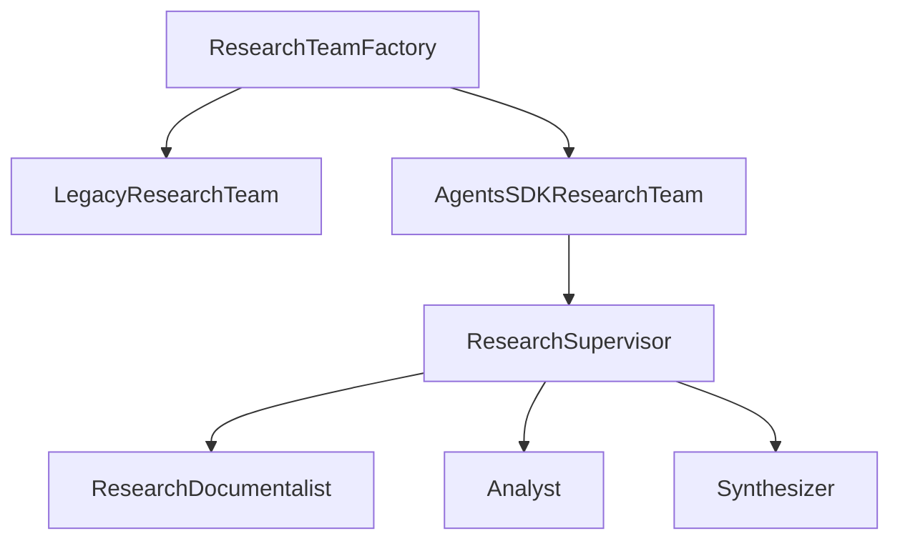
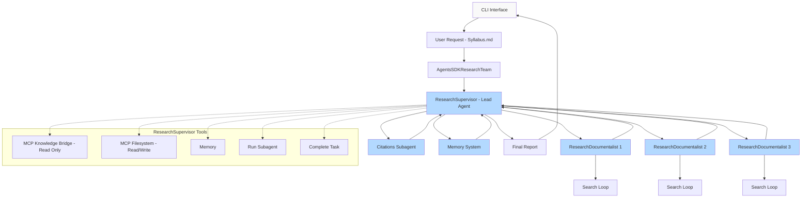

# Plan de Migration ResearchTeam : Stub vers Agents SDK avec Planner et MCP

## Contexte et Problème

Le fichier `src/transcript_generator/tools/research_team.py` fournit une implémentation factice qui se contente de découper le texte et d'écrire un JSON. Cette version ne respecte pas l'architecture de référence : aucune requête n'est effectuée via `KnowledgeMCPServer`, l'Agents SDK n'est pas utilisé et la logique métier est inexistante.

## Objectif de Migration

Réécrire `ResearchTeam` pour obtenir un MVP fonctionnel s'appuyant sur l'Agents SDK, un planner léger et les services MCP (filesystem et knowledge bridge). Le composant doit produire des notes de recherche cohérentes pour l'équipe EditingTeam.

## Architecture Cible

### Pattern Interface/Factory

- `ResearchTeamFactory` choisit l'implémentation (legacy ou Agents SDK) selon la configuration.
- `AgentsSDKResearchTeam` orchestre un ResearchSupervisor et trois agents internes.
- Les agents utilisent `KnowledgeMCPServer` pour la recherche et `FileSystemMCP` pour écrire les résultats.

### Workflow Détaillé

### Processus de Recherche Détaillé

#### 1. ResearchSupervisor (Lead Agent)
Le ResearchSupervisor prend en charge la planification des tâches des sous-agents (subagents). Il reçoit le syllabus de l'utilisateur et identifie les principaux topics (sujets) couverts pour chaque module ainsi que les références nécessaires à utiliser pour rechercher dans la base de connaissance.

**Responsabilités principales :**
- **Planification des tâches** : Organise la production par module de syllabus en regroupant les topics couverts
- **Briefing équipe** : Brief l'équipe de recherche avec des mots-clés spécifiques ou des axes de recherche
- **Assurance qualité** : S'assure de l'exhaustivité de la recherche, créé des sections d'avertissement si la base de connaissance n'est pas complète
- **Gestion des erreurs** : Met CLAIREMENT en erreur si du contenu est complètement absent (ex: sujet RAG présent mais aucun contenu associé)
- **Agenda de recherche** : Travaille sur un agenda qu'il enrichit avec des directives pour les sous-agents
- **Organisation** : Réorganise l'agenda par module puis par topic. Chaque topic a un brief et des mots-clés
- **Parallélisation** : Parallélise le traitement par module ou module-sujet ou module-sujet-fichier-source

**Outils disponibles :**
- MCP Filesystem pour accéder au syllabus et écrire la note de recherche finale
- Exécution des sous-agents via handoff
- Communication inter-agents via context management
- Modèle configurable (o3, anthropic sonnet, mistral)

**Constraintes strictes :**
- **INTERDICTION ABSOLUE** : Aucune source externe (web_search, API externe, etc.)
- **SOURCE UNIQUE** : Uniquement la base de connaissance via MCP Knowledge_bridge
- **Documents autorisés** : Exclusivement les documents spécifiés dans le syllabus
- **Références obligatoires** : Chaque information doit être tracée (nom du fichier source, titre de chapitre, paragraphe ou chunk)
- **Exception agenda** : SEUL le ResearchSupervisor peut utiliser ses connaissances pour créer l'agenda de recherche (combiné au syllabus) afin de guider les tâches des subagents

#### 2. Subagents - Rôles spécialisés

Les subagents exécutent les sous-tâches de production de la note de recherche. L'activité peut être parallélisée par module ou module-section ou module-sujet couvert.

**3 rôles identifiés :**

##### ResearchDocumentalist (ex-Researcher)
- À partir de l'extrait de l'agenda de recherche, identifie mots-clés, tags, questions à poser
- Recherche dans knowledge_bridge via MCP pour récupérer les fichiers correspondants aux besoins
- Rassemble les fichiers puis passe la main à Analyst
- **Outils** : MCP KnowledgeBridge UNIQUEMENT
- **Contrainte absolue** : Ne peut utiliser QUE les documents de la base de connaissance spécifiés dans le syllabus
- **Note** : N'accède pas directement à une section du syllabus mais à une section de l'agenda de recherche enrichie par le ResearchSupervisor

##### Analyst
- À partir des documents transmis par ResearchDocumentalist et l'extrait d'agenda de recherche
- Produit un extrait de recherche exhaustive, objective et bien structurée
- Sélectionne les éléments les plus pertinents
- Identifie les informations manquantes et les met en avertissement
- **Outils** : Aucun outil ou MCP (travail d'analyse pure)
- **Contrainte absolue** : Ne peut utiliser QUE le contenu fourni par ResearchDocumentalist (base de connaissance uniquement)

##### Synthesizer
- Prend le contenu sélectionné pour créer une note de synthèse complète et bien rédigée
- Conserve les références dans le résultat
- Retourne le résultat au ResearchSupervisor pour validation
- **Outils** : Aucun outil ou MCP (le ResearchSupervisor valide avant écriture finale)
- **Contrainte absolue** : Ne peut utiliser QUE le contenu analysé par Analyst (base de connaissance uniquement)
- **Références obligatoires** : Doit maintenir la traçabilité complète des sources (fichier, chapitre, paragraphe)

**Note importante :** Un même sous-agent peut prendre en charge les 3 rôles avec un bon prompt, simplifiant potentiellement le workflow.

#### 3. Configuration des Subagents
Les 3 subagents réalisent leurs tâches via LLM (inférence). Leur nom, instructions, outils et modèle utilisé sont décidés par le ResearchSupervisor lors de la génération du plan d'exécution.

**Sélection des modèles :**
- **Tâches complexes** : gpt-4o ou mistral-large
- **Tâches standard** : gpt-4o-mini ou mistral-small (la plupart du temps)

#### 4. Plan et Agenda de Recherche
Le plan et l'agenda de recherche font partie de la même étape du ResearchSupervisor :
- **Le plan** : Définit les tâches à lancer pour compléter l'agenda de recherche
- **L'agenda de recherche** : Structure détaillée des topics et directives
- **Auditabilité** : Plan et agenda sauvegardés via MCP Filesystem

## Plan de Refactoring

### Étape 1 : Création des Interfaces
1. Créer `ResearchContext` (dataclass) contenant `section_id`, `key_topics`, instance de `KnowledgeMCPServer` et chemin d'écriture.
2. Définir l'interface `ResearchTeamWorkflow` avec `research_topic(context) -> ResearchNotes`.
3. Implémenter `BaseResearchTeam` pour les utilitaires communs : appels MCP, formatage des résultats et gestion des erreurs.

### Étape 2 : LegacyResearchTeam
1. Déplacer l'actuelle logique de découpage de texte dans `LegacyResearchTeam` pour conserver un comportement de secours.
2. Cette classe n'est plus utilisée par défaut mais reste disponible via la factory.

### Étape 3 : AgentsSDKResearchTeam
1. Initialiser un ResearchSupervisor (type `StateGraph` minimal) gérant la séquence de sous-agents.
2. Chaque agent est défini via `Agent` (Agents SDK) avec des instructions spécifiques et les outils MCP nécessaires.
3. `research_topic` exécute le supervisor et renvoie les notes structurées.
4. Les fichiers JSON sont écrits via `FileSystemMCPServer.write_research_notes()` après validation du ResearchSupervisor.
5. Ajouter une gestion d'erreurs robuste avec sauvegarde partielle des résultats.

### Étape 4 : Factory et Configuration
1. Créer `ResearchTeamFactory.create(implementation: str)` retournant l'implémentation choisie (`legacy` ou `agents_sdk`).
2. Ajouter un bloc `research_team` dans `config.yaml` pour sélectionner l'implémentation et régler les paramètres (`max_key_points_per_item`, `max_summary_length`, modèles par type de tâche).

### Étape 5 : Tests et Validation
1. Étendre `tests/test_research_team.py` avec `pytest.mark.asyncio` pour tester l'implémentation Agents SDK en simulant `KnowledgeMCPServer`.
2. Vérifier la conformité au schéma `ResearchNotes` et la création du fichier via MCP.
3. Assurer la compatibilité ascendante du comportement legacy.

## Critères d'Acceptation

- [ ] `ResearchTeamFactory` permet de choisir l'implémentation via `config.yaml`.
- [ ] `AgentsSDKResearchTeam` utilise `KnowledgeMCPServer.lookup_content()` et écrit via `FileSystemMCPServer`.
- [ ] Le ResearchSupervisor orchestre correctement les subagents avec reprise sur erreur.
- [ ] Les notes de recherche respectent le schéma `ResearchNotes` et mentionnent les références utilisées.
- [ ] Les requêtes de recherche sont augmentées (synonymes, tags) et la qualité des résultats est évaluée.
- [ ] Les paramètres `max_key_points_per_item` et `max_summary_length` sont appliqués.
- [ ] Le ResearchSupervisor valide les notes avant écriture finale.
- [ ] L'agenda de recherche et le plan d'exécution sont sauvegardés pour auditabilité.
- [ ] Configuration des modèles par type de tâche (complexe vs standard).
- [ ] Gestion des avertissements pour contenu manquant ou incomplet.
- [ ] **CONTRAINTE CRITIQUE** : Aucune source externe utilisée (web_search, API, etc.) - Base de connaissance UNIQUEMENT.
- [ ] **TRAÇABILITÉ OBLIGATOIRE** : Toutes les références sont tracées avec nom de fichier, chapitre, paragraphe.
- [ ] **DOCUMENTS AUTORISÉS** : Seuls les documents spécifiés dans le syllabus sont utilisés.
- [ ] **EXCEPTION AGENDA** : Seul le ResearchSupervisor peut utiliser ses connaissances (combiné au syllabus) pour créer l'agenda.
- [ ] Tous les tests unitaires et d'intégration passent avec `pytest`.
- [ ] Aucune violation des règles énoncées dans `CLAUDE.md`.

## Risques et Mitigation

- **Complexité Agents SDK** : risque de mauvaise orchestration.
  - *Mitigation* : commencer par un supervisor minimal, ajout de tests asynchrones.
- **Dépendances MCP** : indisponibilité du serveur ou erreurs de fichier.
  - *Mitigation* : gestion d'erreurs centralisée et sauvegarde partielle.
- **Régression fonctionnelle** : perte du comportement actuel.
  - *Mitigation* : conserver `LegacyResearchTeam` via la factory et comparer les sorties.
- **Complexité configuration multi-modèles** : risque de mauvaise sélection de modèle.
  - *Mitigation* : configuration par défaut conservative et fallback sur modèles standards.

**Version**: 2.0
**Date**: 2025-01-27