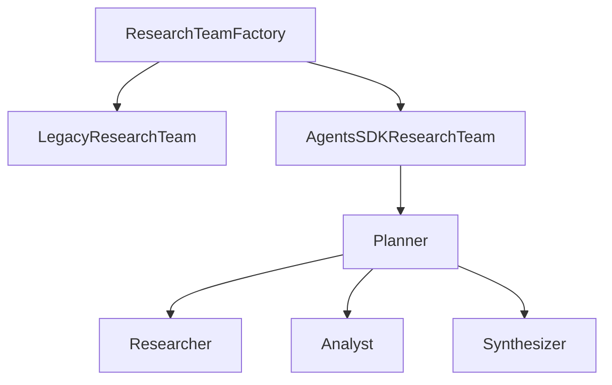
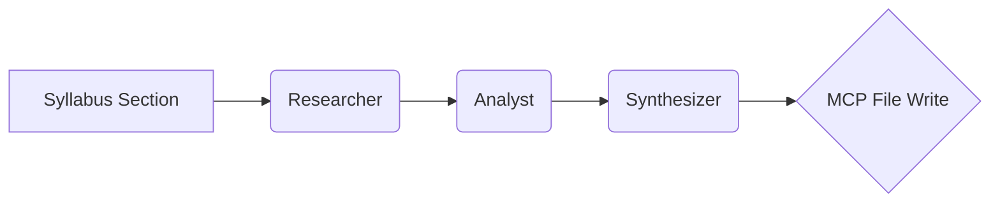
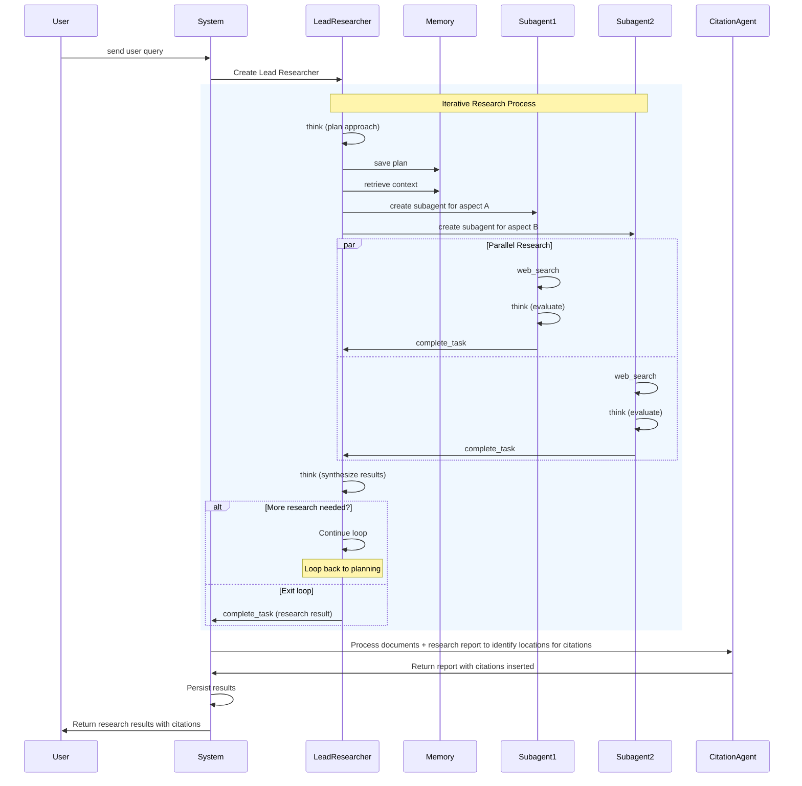

# Plan de Migration ResearchTeam : Stub vers Agents SDK avec Planner et MCP

## Contexte et Problème

Le fichier `src/transcript_generator/tools/research_team.py` fournit une implémentation factice qui se contente de découper le texte et d'écrire un JSON. Cette version ne respecte pas l'architecture de référence : aucune requête n'est effectuée via `KnowledgeMCPServer`, l'Agents SDK n'est pas utilisé et la logique métier est inexistante.

## Objectif de Migration

Réécrire `ResearchTeam` pour obtenir un MVP fonctionnel s'appuyant sur l'Agents SDK, un planner léger et les services MCP (filesystem et knowledge bridge). Le composant doit produire des notes de recherche cohérentes pour l'équipe EditingTeam.

## Architecture Cible

### Pattern Interface/Factory

- `ResearchTeamFactory` choisit l'implémentation (legacy ou Agents SDK) selon la configuration.
- `AgentsSDKResearchTeam` orchestre un planner et trois agents internes.
- Les agents utilisent `KnowledgeMCPServer` pour la recherche et `FileSystemMCP` pour écrire les résultats.

### Workflow Simplifié

1. **Researcher** : interroge `KnowledgeMCPServer.lookup_content()` avec les topics du syllabus.
2. **Analyst** : sélectionne les items pertinents et extrait les points clés via LLM.
3. **Synthesizer** : génère le résumé narratif et déclenche l'écriture MCP.
4. **Planner** : supervise la séquence, évalue la qualité des résultats et itère si besoin.

### Processus de Recherche Détaillé
1. **Génération des requêtes** : le Planner fournit au Researcher les `key_topics` de la section.
   - Le Researcher produit une liste de requêtes augmentées (synonymes, tags, questions) pour `lookup_content()`.
2. **Collecte des extraits** : `KnowledgeMCPServer.lookup_content()` renvoie des aperçus de contenu.
   - Si la qualité ou le nombre de résultats est insuffisant, le Planner élargit le périmètre (nouvelles requêtes, `web_search` de Response API).
   - Si trop de contenu est renvoyé, l'Analyst priorise les items les plus pertinents (score de similarité, fraîcheur).
3. **Évaluation** : l'Analyst résume chaque extrait en points clés sémantiques.
4. **Synthèse** : le Synthesizer produit un `research_summary` cohérent mentionnant les références retenues.

**Agenda de recherche (exemple)**
- Mots clés principaux issus du syllabus
- Requêtes élargies avec synonymes et tags associés
- Questions ciblées pour identifier bonnes pratiques et pièges fréquents
- Utilisation optionnelle de `web_search` pour compléter les références internes

### Diagramme de Séquence détaillé

## Plan de Refactoring

### Étape 1 : Création des Interfaces
1. Créer `ResearchContext` (dataclass) contenant `section_id`, `key_topics`, instance de `KnowledgeMCPServer` et chemin d'écriture.
2. Définir l'interface `ResearchTeamWorkflow` avec `research_topic(context) -> ResearchNotes`.
3. Implémenter `BaseResearchTeam` pour les utilitaires communs : appels MCP, formatage des résultats et gestion des erreurs.

### Étape 2 : LegacyResearchTeam
1. Déplacer l'actuelle logique de découpage de texte dans `LegacyResearchTeam` pour conserver un comportement de secours.
2. Cette classe n'est plus utilisée par défaut mais reste disponible via la factory.

### Étape 3 : AgentsSDKResearchTeam
1. Initialiser un planner (type `StateGraph` minimal) gérant la séquence Researcher → Analyst → Synthesizer.
2. Chaque agent est défini via `Agent` (Agents SDK) avec des instructions spécifiques et les outils MCP nécessaires.
3. `research_topic` exécute le planner et renvoie les notes structurées.
4. Les fichiers JSON sont écrits via `FileSystemMCPServer.write_research_notes()`.
5. Ajouter une gestion d’erreurs robuste avec sauvegarde partielle des résultats.

### Étape 4 : Factory et Configuration
1. Créer `ResearchTeamFactory.create(implementation: str)` retournant l’implémentation choisie (`legacy` ou `agents_sdk`).
2. Ajouter un bloc `research_team` dans `config.yaml` pour sélectionner l’implémentation et régler les paramètres (`max_key_points_per_item`, `max_summary_length`).

### Étape 5 : Tests et Validation
1. Étendre `tests/test_research_team.py` avec `pytest.mark.asyncio` pour tester l’implémentation Agents SDK en simulant `KnowledgeMCPServer`.
2. Vérifier la conformité au schéma `ResearchNotes` et la création du fichier via MCP.
3. Assurer la compatibilité ascendante du comportement legacy.

## Critères d'Acceptation

- [ ] `ResearchTeamFactory` permet de choisir l’implémentation via `config.yaml`.
- [ ] `AgentsSDKResearchTeam` utilise `KnowledgeMCPServer.lookup_content()` et écrit via `FileSystemMCPServer`.
- [ ] Le planner orchestre correctement Researcher → Analyst → Synthesizer avec reprise sur erreur.
- [ ] Les notes de recherche respectent le schéma `ResearchNotes` et mentionnent les références utilisées.
- [ ] Les requêtes de recherche sont augmentées (synonymes, tags) et la qualité des résultats est évaluée.
- [ ] Les paramètres `max_key_points_per_item` et `max_summary_length` sont appliqués.
- [ ] Tous les tests unitaires et d’intégration passent avec `pytest`.
- [ ] Aucune violation des règles énoncées dans `CLAUDE.md`.

## Risques et Mitigation

- **Complexité Agents SDK** : risque de mauvaise orchestration.
  - *Mitigation* : commencer par un planner minimal, ajout de tests asynchrones.
- **Dépendances MCP** : indisponibilité du serveur ou erreurs de fichier.
  - *Mitigation* : gestion d’erreurs centralisée et sauvegarde partielle.
- **Régression fonctionnelle** : perte du comportement actuel.
  - *Mitigation* : conserver `LegacyResearchTeam` via la factory et comparer les sorties.

**Version**: 1.0
**Date**: 2025-07-01
