# Evernote MCP Chatbot Architecture

> **Note**: This documentation reflects the cleaned-up codebase with dead code removed. Only `proper_mcp_client.py` is used - previous iterations (`mcp_client.py`, `mcp_stdio_client.py`) were debugging artifacts and have been removed.

## System Architecture Overview

```mermaid
graph TB
    %% User Interface Layer
    User[👤 User] --> CLI{CLI Interface}
    CLI --> InteractiveCLI[🔄 Interactive CLI<br/>evernote-chat]
    CLI --> SimpleCLI[⚡ Simple CLI<br/>evernote-search]

    %% Application Layer
    InteractiveCLI --> ChatbotCLI[ChatbotCLI]
    SimpleCLI --> SearchFunction[search_evernote()]

    ChatbotCLI --> Session[ChatSession]
    ChatbotCLI --> Formatter[ResponseFormatter]
    ChatbotCLI --> Handler[EvernoteHandler]
    SearchFunction --> Handler

    %% Business Logic Layer
    Handler --> MCPClient[ProperMCPClient]
    Session --> Config[ChatbotConfig]
    Formatter --> Config

    %% MCP Transport Layer
    MCPClient --> MCPLib[📚 MCP Library<br/>mcp.client.stdio]
    MCPLib --> DockerExec[🐳 Docker Exec Transport]

    %% External Systems
    DockerExec --> Container[🐳 evernote-mcp-server<br/>Docker Container]
    Container --> EvernoteAPI[🗒️ Evernote Thrift API<br/>www.evernote.com]

    %% Data Storage
    Session --> HistoryFile[(📁 History File<br/>~/.evernote_chatbot_history.json)]
    Config --> EnvVars[(🌍 Environment Variables)]

    %% Styling
    classDef userLayer fill:#e1f5fe
    classDef appLayer fill:#f3e5f5
    classDef businessLayer fill:#e8f5e8
    classDef transportLayer fill:#fff3e0
    classDef externalLayer fill:#fce4ec
    classDef dataLayer fill:#f1f8e9

    class User,CLI,InteractiveCLI,SimpleCLI userLayer
    class ChatbotCLI,SearchFunction,Session,Formatter appLayer
    class Handler,MCPClient,Config businessLayer
    class MCPLib,DockerExec transportLayer
    class Container,EvernoteAPI externalLayer
    class HistoryFile,EnvVars dataLayer
```

## Component Interaction Flow


## Data Flow Architecture

```mermaid
flowchart LR
    %% Input Processing
    Query[🔍 User Query] --> Config{⚙️ Apply Config}
    Config --> |notebooks filter| Filter[📁 Notebook Filter]
    Config --> |note limits| Limit[📊 Result Limits]
    Config --> |HTML preference| Format[📝 Content Format]

    %% MCP Communication
    Filter --> MCP[📡 MCP Request]
    Limit --> MCP
    Format --> MCP

    MCP --> Docker[🐳 Docker Exec]
    Docker --> Server[🖥️ MCP Server]
    Server --> Evernote[🗒️ Evernote API]

    %% Response Processing
    Evernote --> RawData[📦 Raw Response]
    RawData --> Parser[🔄 Response Parser]
    Parser --> Metadata[📋 Note Metadata]
    Parser --> Content[📄 Note Content]

    %% Output Generation
    Metadata --> Table[📊 Results Table]
    Content --> Preview[👁️ Content Preview]
    Table --> Display[🖥️ Rich Display]
    Preview --> Display

    %% Session Management
    Display --> Session[💾 Session History]
    Session --> Storage[📁 Persistent Storage]

    %% Styling
    classDef input fill:#e3f2fd
    classDef processing fill:#f3e5f5
    classDef transport fill:#fff8e1
    classDef output fill:#e8f5e8
    classDef storage fill:#fce4ec

    class Query,Config,Filter,Limit,Format input
    class MCP,Parser,Metadata,Content processing
    class Docker,Server,Evernote transport
    class Table,Preview,Display output
    class Session,Storage storage
```



## Module Dependencies

```mermaid
graph LR
    %% Core Modules
    Main[main.py] --> CLI[cli.py]
    Main --> SimpleCLI[simple_cli.py]

    %% CLI Dependencies
    CLI --> Session[session.py]
    CLI --> Formatter[formatter.py]
    CLI --> Handler[evernote_handler.py]
    CLI --> Config[config.py]

    SimpleCLI --> Handler
    SimpleCLI --> Config

    %% Handler Dependencies
    Handler --> MCPClient[proper_mcp_client.py<br/>⚠️ Only MCP Client]

    %% Session Dependencies
    Session --> Config

    %% Formatter Dependencies
    Formatter --> Config

    %% External Libraries
    CLI --> Typer[typer 📚]
    CLI --> Rich[rich 📚]
    Handler --> Pydantic[pydantic 📚]
    Handler --> AsyncIO[asyncio 📚]
    MCPClient --> MCPLibrary[mcp 📚]
    Config --> OS[os/pathlib 📚]

    %% Styling
    classDef coreModule fill:#bbdefb
    classDef businessModule fill:#c8e6c9
    classDef utilityModule fill:#ffe0b2
    classDef externalLib fill:#f8bbd9

    class Main,CLI,SimpleCLI coreModule
    class Handler,Session,Formatter,MCPClient businessModule
    class Config utilityModule
    class Typer,Rich,Pydantic,AsyncIO,MCPLibrary,OS externalLib
```



## Error Handling Architecture

```mermaid
flowchart TD
    %% Error Sources
    UserInput[❌ User Input Errors] --> InputHandler{Input Handler}
    MCPErrors[❌ MCP Connection Errors] --> MCPHandler{MCP Handler}
    EvernoteErrors[❌ Evernote API Errors] --> EvernoteHandler{Evernote Handler}
    SessionErrors[❌ Session/File Errors] --> SessionHandler{Session Handler}

    %% Error Processing
    InputHandler --> |EOF| EOFHandling[Handle EOF gracefully]
    InputHandler --> |Invalid Command| CommandHelp[Show command help]

    MCPHandler --> |Connection Failed| RetryLogic[Retry with backoff]
    MCPHandler --> |Timeout| TimeoutHandling[Display timeout message]

    EvernoteHandler --> |Auth Error| AuthHandling[Show auth instructions]
    EvernoteHandler --> |Rate Limited| RateLimitHandling[Wait and retry]

    SessionHandler --> |File Corrupt| RecoverSession[Create new session]
    SessionHandler --> |Permission Error| FallbackMode[Disable history]

    %% Final Error Handling
    EOFHandling --> GracefulExit[Clean Exit]
    CommandHelp --> ContinueSession[Continue Session]
    RetryLogic --> |Success| ContinueSession
    RetryLogic --> |Fail| GracefulExit
    TimeoutHandling --> ContinueSession
    AuthHandling --> GracefulExit
    RateLimitHandling --> ContinueSession
    RecoverSession --> ContinueSession
    FallbackMode --> ContinueSession

    %% Styling
    classDef errorSource fill:#ffcdd2
    classDef errorHandler fill:#fff3e0
    classDef resolution fill:#c8e6c9
    classDef exit fill:#e1bee7

    class UserInput,MCPErrors,EvernoteErrors,SessionErrors errorSource
    class InputHandler,MCPHandler,EvernoteHandler,SessionHandler errorHandler
    class EOFHandling,CommandHelp,RetryLogic,TimeoutHandling,AuthHandling,RateLimitHandling,RecoverSession,FallbackMode resolution
    class GracefulExit,ContinueSession exit
```



## Configuration System

```mermaid
graph TB
    %% Configuration Sources
    EnvVars[🌍 Environment Variables] --> ConfigLoader{Config Loader}
    CLIArgs[⚡ CLI Arguments] --> ConfigLoader
    Defaults[🔧 Default Values] --> ConfigLoader

    %% Configuration Processing
    ConfigLoader --> MergedConfig[📋 Merged Configuration]

    %% Configuration Categories
    MergedConfig --> MCPConfig[🔗 MCP Configuration]
    MergedConfig --> UIConfig[🖥️ UI Configuration]
    MergedConfig --> SessionConfig[💾 Session Configuration]
    MergedConfig --> SearchConfig[🔍 Search Configuration]

    %% MCP Settings
    MCPConfig --> MCPUrl[MCP_URL]
    MCPConfig --> MCPHeaders[MCP_HEADERS]
    MCPConfig --> MCPTimeout[MCP_TIMEOUT]
    MCPConfig --> ContainerName[CONTAINER_NAME]

    %% UI Settings
    UIConfig --> PreferHTML[PREFER_HTML]
    UIConfig --> MaxDisplay[MAX_DISPLAY_NOTES]

    %% Session Settings
    SessionConfig --> SaveHistory[SAVE_HISTORY]
    SessionConfig --> HistoryFile[HISTORY_FILE]

    %% Search Settings
    SearchConfig --> AllowedNotebooks[ALLOWED_NOTEBOOKS]
    SearchConfig --> MaxNotes[MAX_NOTES_PER_QUERY]

    %% Styling
    classDef source fill:#e3f2fd
    classDef processor fill:#f3e5f5
    classDef category fill:#e8f5e8
    classDef setting fill:#fff3e0

    class EnvVars,CLIArgs,Defaults source
    class ConfigLoader,MergedConfig processor
    class MCPConfig,UIConfig,SessionConfig,SearchConfig category
    class MCPUrl,MCPHeaders,MCPTimeout,ContainerName,PreferHTML,MaxDisplay,SaveHistory,HistoryFile,AllowedNotebooks,MaxNotes setting
```

