# Evernote AI Agent Chatbot Architecture

> **Note**: This architecture uses OpenAI Agents SDK for intelligent query processing. The agent interprets natural language and autonomously selects MCP tools to accomplish user requests.

## System Architecture Overview

```mermaid
graph TB
    %% User Interface Layer
    User[👤 User] --> CLI[🔄 Interactive CLI<br/>evernote-chat]

    %% Application Layer
    CLI --> ChatbotCLI[ChatbotCLI]
    ChatbotCLI --> Session[ChatSession]
    ChatbotCLI --> Formatter[ResponseFormatter]

    %% AI Agent Layer
    ChatbotCLI --> AgentModule[🤖 Agents Module]
    AgentModule --> EvernoteAgent[Evernote AI Agent<br/>OpenAI Agents SDK]
    AgentModule --> Runner[Agent Runner<br/>Streaming Support]

    %% MCP Integration Layer
    EvernoteAgent --> MCPServer[MCPServerStdio<br/>Agents SDK MCP]
    MCPServer --> DockerExec[🐳 Docker Exec Transport]

    %% External Systems
    DockerExec --> Container[🐳 evernote-mcp-server<br/>Docker Container]
    Container --> EvernoteAPI[🗒️ Evernote Thrift API<br/>www.evernote.com]

    %% AI Services
    EvernoteAgent --> OpenAI[🧠 OpenAI API<br/>GPT-4]

    %% Data Storage & Config
    Session --> HistoryFile[(📁 History File<br/>~/.evernote_chatbot_history.json)]
    Session --> Config[ChatbotConfig]
    Formatter --> Config
    Config --> EnvVars[(🌍 Environment Variables<br/>OPENAI_API_KEY)]

    %% Styling
    classDef userLayer fill:#e1f5fe
    classDef appLayer fill:#f3e5f5
    classDef agentLayer fill:#fff9c4
    classDef mcpLayer fill:#e8f5e8
    classDef externalLayer fill:#fce4ec
    classDef dataLayer fill:#f1f8e9

    class User,CLI userLayer
    class ChatbotCLI,Session,Formatter appLayer
    class AgentModule,EvernoteAgent,Runner agentLayer
    class MCPServer,DockerExec mcpLayer
    class Container,EvernoteAPI,OpenAI externalLayer
    class HistoryFile,Config,EnvVars dataLayer
```



## Component Interaction Flow


## Data Flow Architecture

```mermaid
flowchart LR
    %% Input Processing
    Query[🔍 User Query] --> Config{⚙️ Apply Config}
    Config --> |notebooks filter| Filter[📁 Notebook Filter]
    Config --> |note limits| Limit[📊 Result Limits]
    Config --> |HTML preference| Format[📝 Content Format]

    %% MCP Communication
    Filter --> MCP[📡 MCP Request]
    Limit --> MCP
    Format --> MCP

    MCP --> Docker[🐳 Docker Exec]
    Docker --> Server[🖥️ MCP Server]
    Server --> Evernote[🗒️ Evernote API]

    %% Response Processing
    Evernote --> RawData[📦 Raw Response]
    RawData --> Parser[🔄 Response Parser]
    Parser --> Metadata[📋 Note Metadata]
    Parser --> Content[📄 Note Content]

    %% Output Generation
    Metadata --> Table[📊 Results Table]
    Content --> Preview[👁️ Content Preview]
    Table --> Display[🖥️ Rich Display]
    Preview --> Display

    %% Session Management
    Display --> Session[💾 Session History]
    Session --> Storage[📁 Persistent Storage]

    %% Styling
    classDef input fill:#e3f2fd
    classDef processing fill:#f3e5f5
    classDef transport fill:#fff8e1
    classDef output fill:#e8f5e8
    classDef storage fill:#fce4ec

    class Query,Config,Filter,Limit,Format input
    class MCP,Parser,Metadata,Content processing
    class Docker,Server,Evernote transport
    class Table,Preview,Display output
    class Session,Storage storage
```



## Module Dependencies

```mermaid
graph LR
    %% Core Modules
    Main[main.py] --> InteractiveCLI[interactive_cli.py]

    %% CLI Dependencies
    InteractiveCLI --> Session[session.py]
    InteractiveCLI --> Formatter[formatter.py]
    InteractiveCLI --> AgentsModule[agents.py<br/>🤖 AI Agent]
    InteractiveCLI --> Config[config.py]

    %% Agents Module Dependencies
    AgentsModule --> AgentsSDK[agents 📚<br/>OpenAI Agents SDK]
    AgentsModule --> OpenAI[openai 📚]
    AgentsModule --> MCPIntegration[agents.mcp 📚<br/>MCPServerStdio]
    AgentsModule --> Config

    %% Session Dependencies
    Session --> Config

    %% Formatter Dependencies
    Formatter --> Config

    %% External Libraries
    InteractiveCLI --> Typer[typer 📚]
    InteractiveCLI --> Rich[rich 📚]
    AgentsModule --> Pydantic[pydantic 📚]
    AgentsModule --> AsyncIO[asyncio 📚]
    AgentsModule --> DotEnv[python-dotenv 📚]
    Config --> OS[os/pathlib 📚]

    %% Styling
    classDef coreModule fill:#bbdefb
    classDef agentModule fill:#fff9c4
    classDef businessModule fill:#c8e6c9
    classDef utilityModule fill:#ffe0b2
    classDef externalLib fill:#f8bbd9

    class Main,InteractiveCLI coreModule
    class AgentsModule agentModule
    class Session,Formatter businessModule
    class Config utilityModule
    class Typer,Rich,Pydantic,AsyncIO,AgentsSDK,OpenAI,MCPIntegration,DotEnv,OS externalLib
```



## Error Handling Architecture


## Configuration System

```mermaid
graph TB
    %% Configuration Sources
    EnvVars[🌍 Environment Variables] --> ConfigLoader{Config Loader}
    CLIArgs[⚡ CLI Arguments] --> ConfigLoader
    Defaults[🔧 Default Values] --> ConfigLoader

    %% Configuration Processing
    ConfigLoader --> MergedConfig[📋 Merged Configuration]

    %% Configuration Categories
    MergedConfig --> MCPConfig[🔗 MCP Configuration]
    MergedConfig --> UIConfig[🖥️ UI Configuration]
    MergedConfig --> SessionConfig[💾 Session Configuration]
    MergedConfig --> SearchConfig[🔍 Search Configuration]

    %% MCP Settings
    MCPConfig --> MCPUrl[MCP_URL]
    MCPConfig --> MCPHeaders[MCP_HEADERS]
    MCPConfig --> MCPTimeout[MCP_TIMEOUT]
    MCPConfig --> ContainerName[CONTAINER_NAME]

    %% UI Settings
    UIConfig --> PreferHTML[PREFER_HTML]
    UIConfig --> MaxDisplay[MAX_DISPLAY_NOTES]

    %% Session Settings
    SessionConfig --> SaveHistory[SAVE_HISTORY]
    SessionConfig --> HistoryFile[HISTORY_FILE]

    %% Search Settings
    SearchConfig --> AllowedNotebooks[ALLOWED_NOTEBOOKS]
    SearchConfig --> MaxNotes[MAX_NOTES_PER_QUERY]

    %% Styling
    classDef source fill:#e3f2fd
    classDef processor fill:#f3e5f5
    classDef category fill:#e8f5e8
    classDef setting fill:#fff3e0

    class EnvVars,CLIArgs,Defaults source
    class ConfigLoader,MergedConfig processor
    class MCPConfig,UIConfig,SessionConfig,SearchConfig category
    class MCPUrl,MCPHeaders,MCPTimeout,ContainerName,PreferHTML,MaxDisplay,SaveHistory,HistoryFile,AllowedNotebooks,MaxNotes setting
```


## AI Agent Extensibility

The architecture is designed to support multiple specialized agents working together:

### Current Agent: Evernote Search Agent
- **Role**: Query and retrieve Evernote notes using MCP tools
- **Capabilities**: Natural language search, note content retrieval, metadata extraction
- **Tools**: createSearch, getSearch, getNote, getNoteContent

### Future Agent Extensions

#### 1. Summarization Agent
```python
summarization_agent = Agent(
    name="Note Summarization Agent",
    instructions="Summarize Evernote notes concisely...",
    tools=[custom_summarization_tool]
)
```

#### 2. Analysis Agent
```python
analysis_agent = Agent(
    name="Content Analysis Agent",
    instructions="Analyze note content for insights, trends, and patterns...",
    tools=[analysis_tool, trend_detection_tool]
)
```

#### 3. Organization Agent
```python
organization_agent = Agent(
    name="Note Organization Agent",
    instructions="Suggest tags, categories, and reorganization strategies...",
    tools=[tag_suggestion_tool, categorization_tool]
)
```

### Multi-Agent Coordination

Agents can be coordinated using:
- **Sequential**: One agent passes results to another
- **Parallel**: Multiple agents work on different aspects simultaneously  
- **Hierarchical**: A coordinator agent delegates to specialized agents

Example coordination:
```python
coordinator_agent = Agent(
    name="Evernote Assistant Coordinator",
    instructions="Coordinate between search, summarization, and analysis agents...",
    tools=[
        search_agent.as_tool(),
        summarization_agent.as_tool(),
        analysis_agent.as_tool()
    ]
)
```

## Key Design Principles

1. **Separation of Concerns**: CLI, Agent Logic, and MCP Communication are independent
2. **Extensibility**: Easy to add new agents without modifying core infrastructure
3. **Streaming First**: Real-time response streaming for better UX
4. **Context Management**: Automatic MCP connection lifecycle management
5. **Conversation Memory**: Session persistence for contextual follow-ups
6. **Error Resilience**: Graceful degradation and clear error messages

## Technology Stack

- **AI Framework**: OpenAI Agents SDK (0.2.9+)
- **LLM**: OpenAI GPT-4
- **MCP Protocol**: Model Context Protocol for tool integration
- **CLI Framework**: Typer + Rich for beautiful terminal UI
- **Async Runtime**: asyncio for concurrent operations
- **Configuration**: python-dotenv for environment management
