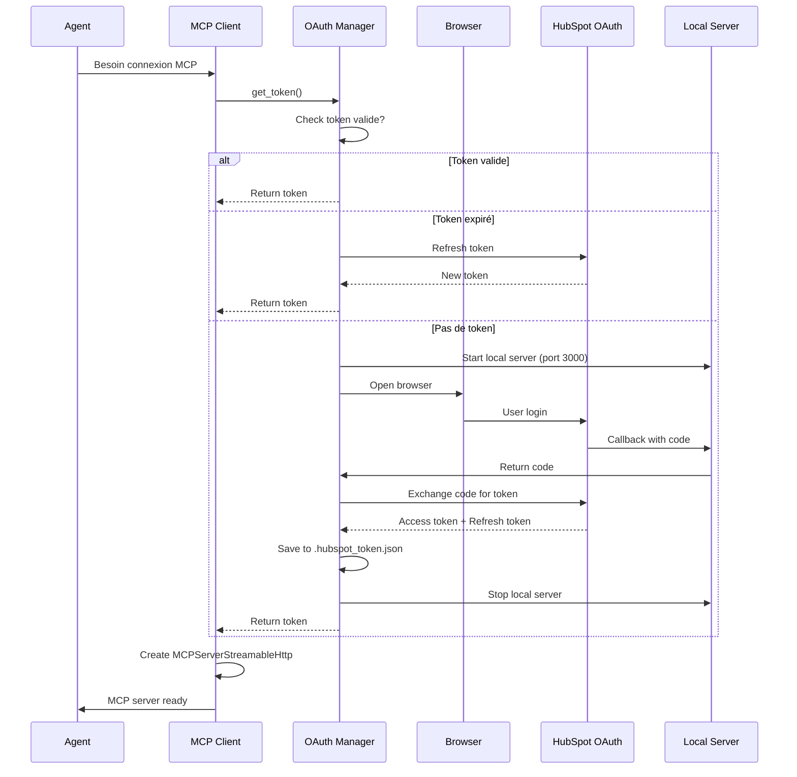

# MCP - Ce que vous devez savoir avant de vous lancer

> **Retours d'expérience pratiques sur le développement avec Model Context Protocol (MCP)**
>
> Document basé sur 3 implémentations réelles :
> - **mcp-evernote-cc** : Chatbot Evernote avec Docker + stdio
> - **customer_onboarding** : Intégration HubSpot avec OAuth + Streamable HTTP
> - **agentic-research** : Serveur MCP custom pour DataPrep avec SSE

---

## 🎯 Public Cible

Ce document s'adresse aux **Applied Engineers** qui :
- ✅ Ont lu la documentation de base MCP (quickstart)
- ✅ Ont vu les vidéos d'introduction (deeplearning.ai)
- ✅ Ont peut-être branché 1-2 MCP dans Claude ou Cursor
- 🎯 Veulent maintenant utiliser MCP dans leurs propres projets AI

**Objectif** : Partager les pièges, patterns et leçons apprises au-delà de la documentation officielle.

---

## 📚 Les 3 Types de MCP - L'Essentiel

Le MCP expose 3 types de capacités aux agents LLM :

### 1. **Prompts** (Templates)
Fournit des prompts pré-définis et contextualisés aux agents.

**Cas d'usage** : Standardiser les interactions, templates de requêtes

### 2. **Resources** (Données)
Expose des ressources en lecture seule (fichiers, données, documentation).

**Cas d'usage** : Documentation, contexte statique, données de référence

### 3. **Tools** (Actions)
Expose des fonctions exécutables par l'agent.

**Cas d'usage** : Actions, intégrations API, transformations de données

> **Note pratique** : Dans nos 3 projets, on utilise principalement des **Tools** car ils permettent l'interactivité et les actions concrètes.

---

## 🔧 Les 2 Protocoles de Transport - Stdio vs SSE/HTTP

### **Stdio** (Standard Input/Output)

**Quand l'utiliser** :
- ✅ Serveurs MCP locaux (Docker, processus local)
- ✅ Desktop apps avec accès terminal
- ✅ Développement et debugging (logs directs)

**Limitations** :
- ❌ Ne fonctionne pas avec SaaS (ChatGPT, Le Chat, etc.)
- ❌ Nécessite accès processus local
- ❌ Complexe pour le déploiement cloud

**Exemple (Evernote via Docker)** :
```python
from agents.mcp import MCPServerStdio

evernote_mcp_server = MCPServerStdio(
    name="EVERNOTE_MCP_SERVER",
    params={
        "command": "docker",
        "args": [
            "exec", "-i", "--tty=false",
            container_name,
            "sh", "-c", "node mcp-server.js 2>/dev/null"
        ],
    },
    cache_tools_list=True,
)
```

### **Streamable HTTP / SSE** (Server-Sent Events)

**Quand l'utiliser** :
- ✅ Serveurs MCP distants (cloud, SaaS)
- ✅ Intégrations OAuth nécessaires
- ✅ Déploiement web/production
- ✅ Accès depuis n'importe où (ChatGPT, agents cloud)

**Limitations** :
- ❌ Plus complexe à configurer (auth, headers, URL)
- ❌ Latence réseau à considérer
- ❌ Nécessite infrastructure déployée

**Exemple (HubSpot OAuth)** :
```python
from agents.mcp import MCPServerStreamableHttp

token = await oauth()

mcp_hubspot_server = MCPServerStreamableHttp(
    name="Streamable HTTP Python Server",
    params={
        "url": "https://mcp.hubspot.com",
        "headers": {"Authorization": f"Bearer {token['access_token']}"},
        "timeout": 10
    },
    cache_tools_list=True,
    max_retry_attempts=3,
)
```

### **Comparaison Pratique**

| Critère | Stdio | Streamable HTTP/SSE |
|---------|-------|---------------------|
| **Latence** | Très faible (local) | Dépend du réseau |
| **Sécurité** | Processus local (sandbox) | OAuth, HTTPS |
| **Déploiement** | Simple (local) | Infrastructure requise |
| **Debugging** | Facile (logs directs) | Plus complexe (réseau) |
| **SaaS Compatible** | ❌ Non | ✅ Oui |
| **Production** | ❌ Limité | ✅ Recommandé |

---

## ⚠️ LEÇON #1 : Cycle de Vie du Client MCP

### Le Problème : "Server not initialized"

**Erreur rencontrée** (commit d9294ac) :
```
❌ Error: Server not initialized
❌ MCP connection closed unexpectedly
```

### Cause Racine

Ne **JAMAIS** créer un wrapper custom qui gère le cycle de vie du client MCP. Le client MCP doit être géré via **async context manager**.

**Mauvais Pattern (à éviter)** :
```python
# ❌ NE PAS FAIRE ÇA - Custom wrapper manuel
class CustomMCPClient:
    def __init__(self):
        self.client = None

    def connect(self):
        # Connection manuelle
        pass

    def disconnect(self):
        # Disconnection manuelle
        pass
```

**Bon Pattern** :
```python
# ✅ BON - Utiliser MCPServerStdio natif avec context manager
from agents.mcp import MCPServerStdio

async with MCPServerStdio(...) as mcp_server:
    agent = Agent(
        name="My Agent",
        mcp_servers=[mcp_server],  # Agent découvre automatiquement les tools
    )
    result = await Runner.run(agent, conversation)
```

### Leçons Clés

1. **Ne pas réinventer la roue** : Utiliser `MCPServerStdio` ou `MCPServerStreamableHttp` natifs
2. **Context Manager obligatoire** : `async with mcp_server as server:` garantit le lifecycle
3. **Scope de session** : Créer le serveur MCP au début de la session, le réutiliser pour toutes les requêtes
4. **Éviter le multithreading** : Un client MCP par session, pas de partage entre threads

### Évolution du Code (mcp-evernote-cc)

**Avant** (166 lignes de wrapper custom supprimées) :
```python
# ❌ ProperMCPClient custom avec gestion manuelle
class ProperMCPClient:
    async def initialize(self):
        # Gestion manuelle lifecycle
        pass
```

**Après** (architecture simplifiée) :
```python
# ✅ MCPServerStdio natif + context manager
async with MCPServerStdio(...) as mcp_server:
    agent = _create_evernote_agent_with_mcp(mcp_server)
    result = await Runner.run(agent, conversation)
```

**Bénéfices** :
- 📉 -166 lignes de code custom
- 🐛 Erreurs "Server not initialized" résolues
- 🚀 Découverte automatique des tools par l'agent
- 🔄 Meilleure gestion du cycle de vie

---

## ⚠️ LEÇON #2 : OAuth et Authentification Distante

### Le Challenge : HubSpot MCP avec OAuth

**Contexte** : Intégrer le serveur MCP HubSpot nécessite :
1. OAuth 2.0 flow (authorization code)
2. Token refresh automatique
3. Persistance du token entre sessions

### Architecture OAuth Complète



### Implémentation Complète

**Fichier** : `experiments/customer_onboarding/my_agents/oauth.py` (286 lignes)

**Pattern Singleton + Thread-Safe** :
```python
class OAuthManager:
    def __init__(self):
        self._token: Optional[Dict[str, Any]] = None
        self._lock = asyncio.Lock()  # Thread-safety
        self._server: Optional[HTTPServer] = None

    async def get_token(self) -> Dict[str, Any]:
        async with self._lock:
            # 1. Load from file
            if self._token is None:
                self._token = self._load_token_from_file()

            # 2. Check validity (with 5min margin)
            if self._token and self._is_token_valid(self._token):
                return self._token

            # 3. Try refresh
            if self._token and self._token.get("refresh_token"):
                try:
                    self._token = await self._refresh_token(...)
                    return self._token
                except Exception:
                    pass

            # 4. New OAuth flow
            self._token = await self._do_oauth_flow()
            return self._token
```

### Flow OAuth Détaillé

**1. Local Callback Server** :
```python
async def _start_local_server(self) -> None:
    # Try ports 3000-3009 (fallback if occupied)
    for port in range(3000, 3010):
        try:
            self._server = HTTPServer(("localhost", port), OAuthHandler)
            self._server.auth_event = threading.Event()
            self._server_thread = threading.Thread(
                target=self._server.serve_forever,
                daemon=True
            )
            self._server_thread.start()
            return
        except OSError as e:
            continue
```

**2. Browser Flow** :
```python
async def _do_oauth_flow(self) -> Dict[str, Any]:
    oauth_session = OAuth2Session(
        client_id=CLIENT_ID,
        redirect_uri=REDIRECT_URI,
        scope=["crm.objects.contacts.read", "crm.objects.companies.read", ...]
    )

    authorization_url, state = oauth_session.authorization_url(
        AUTHORIZATION_BASE_URL
    )

    webbrowser.open(authorization_url)

    # Wait for callback (5min timeout)
    if not self._server.auth_event.wait(timeout=300):
        raise TimeoutError("OAuth callback timeout")

    # Exchange code for token
    token = oauth_session.fetch_token(
        TOKEN_URL,
        code=self._server.auth_code,
        client_secret=CLIENT_SECRET,
    )

    return token
```

**3. Token Persistence** :
```python
TOKEN_FILE = Path(".hubspot_token.json")

def _save_token_to_file(self, token: Dict[str, Any]) -> None:
    with open(TOKEN_FILE, 'w') as f:
        json.dump(token, f, indent=2)

def _is_token_valid(self, token: Dict[str, Any]) -> bool:
    expires_at = token.get("expires_at")
    margin = 5 * 60  # 5 minutes
    return time.time() < (expires_at - margin)
```

### Utilisation avec MCP

```python
async def run_onboarding_agent_with_mcp(conversation: list[dict[str, str]]):
    # 1. Get valid token (auto-refresh if needed)
    token = await oauth()

    # 2. Create MCP server with auth header
    mcp_hubspot_server = MCPServerStreamableHttp(
        name="Streamable HTTP Python Server",
        params={
            "url": "https://mcp.hubspot.com",
            "headers": {"Authorization": f"Bearer {token['access_token']}"},
            "timeout": 10
        },
        cache_tools_list=True,
        max_retry_attempts=3,
    )

    # 3. Use MCP server in agent context
    async with mcp_hubspot_server as server:
        customer_onboarding_agent = _create_agents_with_mcp(server)
        result = await Runner.run(customer_onboarding_agent, conversation)
        return result
```

### Leçons OAuth

1. **Singleton pattern** : Une seule instance d'OAuthManager pour éviter les conflits
2. **Token refresh automatique** : Vérifier validité avant chaque utilisation (marge 5min)
3. **Persistance fichier** : `.hubspot_token.json` pour réutiliser entre sessions
4. **Local server avec ports fallback** : Essayer 3000-3009 si occupé
5. **Thread-safety** : `asyncio.Lock()` pour opérations concurrentes
6. **Timeout reasonable** : 5 minutes pour OAuth flow
7. **Cleanup server** : Toujours stopper le serveur local après callback

---

## ⚠️ LEÇON #3 : Créer un Serveur MCP Custom

### Cas d'Usage : MCP DataPrep Server

**Objectif** : Serveur MCP custom pour gérer la préparation de données et vector stores OpenAI.

**Architecture** :
```
Agent → MCP DataPrep Server (SSE) → Knowledge DB (JSON + Files)
                ↓
        OpenAI Files API + Vector Store
```

### Implémentation avec FastMCP

**Fichier** : `experiments/agentic-research/src/mcp/dataprep_server.py`

```python
from fastmcp import FastMCP

def create_dataprep_server() -> FastMCP:
    mcp = FastMCP(
        name="DataPrep MCP Server",
        instructions="""
        Serveur MCP pour la préparation de données et gestion de vector stores.

        Outils disponibles:
        - download_and_store_url: Télécharge et stocke une URL
        - upload_files_to_vectorstore: Upload vers OpenAI Vector Store
        - get_knowledge_entries: Liste les entrées de la base
        """,
    )

    # Tool 1: Download and Store
    @mcp.tool()
    def download_and_store_url_tool(url: str) -> str:
        """
        Télécharge et stocke une URL dans le système local.

        Args:
            url: URL à télécharger

        Returns:
            str: Nom du fichier local créé (.md)
        """
        config = get_config()
        return download_and_store_url(url, config)

    # Tool 2: Upload to Vector Store
    @mcp.tool()
    def upload_files_to_vectorstore_tool(
        inputs: list[str],
        vectorstore_name: str
    ) -> dict[str, Any]:
        """
        Upload des fichiers vers un vector store OpenAI.

        Args:
            inputs: Liste d'URLs ou noms de fichiers locaux
            vectorstore_name: Nom du vector store à créer

        Returns:
            Dict avec vectorstore_id et métriques
        """
        config = get_config()
        result = upload_files_to_vectorstore(inputs, config, vectorstore_name)
        return result.model_dump()

    # Tool 3: Get Knowledge Entries
    @mcp.tool()
    def get_knowledge_entries_tool() -> list[dict[str, Any]]:
        """
        Liste toutes les entrées de la base de connaissances.

        Returns:
            List[Dict]: Entrées avec url, filename, title, keywords
        """
        config = get_config()
        return get_knowledge_entries(config)

    return mcp

def start_server(host: str = "0.0.0.0", port: int = 8001):
    """Démarre le serveur MCP dataprep."""
    server = create_dataprep_server()
    server.run(transport="sse", host=host, port=port)
```

### Démarrage du Serveur

```bash
# Démarrer le serveur MCP DataPrep
poetry run dataprep_server

# Le serveur sera accessible sur http://localhost:8001 avec transport SSE
```

### Backend : Knowledge Database Thread-Safe

**Problème** : Accès concurrent à `knowledge_db.json` depuis plusieurs agents.

**Solution** : Portalocker + Pattern Read-Merge-Write atomique.

**Fichier** : `src/dataprep/knowledge_db.py`

```python
import portalocker
from contextlib import contextmanager

class KnowledgeDBManager:
    def __init__(self, db_path: Path):
        self.db_path = Path(db_path)
        self.db_path.parent.mkdir(parents=True, exist_ok=True)

    @contextmanager
    def _file_lock(self, mode='r+'):
        """Context manager pour verrouillage de fichier."""
        if not self.db_path.exists() and 'r' in mode:
            self._initialize_empty_db()

        with open(self.db_path, mode, encoding='utf-8') as f:
            try:
                portalocker.lock(f, portalocker.LOCK_EX)
                yield f
            finally:
                portalocker.unlock(f)

    def add_entry(self, entry: KnowledgeEntry) -> None:
        """Pattern read-merge-write thread-safe."""
        with self._file_lock('r+') as f:
            # READ
            f.seek(0)
            data = json.load(f)
            db = KnowledgeDatabase(**data)

            # MERGE
            db.add_entry(entry)

            # WRITE
            f.seek(0)
            f.truncate()
            f.write(db.model_dump_json(indent=2))
```

### Modèles de Données

**Fichier** : `src/dataprep/models.py`

```python
from pydantic import BaseModel, Field, HttpUrl
from datetime import datetime

class KnowledgeEntry(BaseModel):
    url: HttpUrl
    filename: str
    title: Optional[str] = None
    keywords: List[str] = Field(default_factory=list)
    summary: Optional[str] = None
    openai_file_id: Optional[str] = None  # Optimisation uploads
    created_at: datetime = Field(default_factory=datetime.now)
    last_uploaded_at: Optional[datetime] = None

class KnowledgeDatabase(BaseModel):
    entries: List[KnowledgeEntry] = Field(default_factory=list)
    version: str = Field(default="1.0")
    last_updated: datetime = Field(default_factory=datetime.now)

    def find_by_url(self, url: str) -> Optional[KnowledgeEntry]:
        for entry in self.entries:
            if str(entry.url) == url:
                return entry
        return None

    def find_by_name(self, filename: str) -> Optional[KnowledgeEntry]:
        for entry in self.entries:
            if entry.filename == filename:
                return entry
        return None
```

### Optimisation : Réutilisation des Uploads OpenAI

**Problème** : Re-upload des mêmes fichiers à chaque session → coût et temps.

**Solution** : Stocker `openai_file_id` dans knowledge_db.json.

```python
def upload_files_to_vectorstore(
    inputs: List[str],
    config,
    vectorstore_name: str
) -> UploadResult:
    files_to_attach = []
    upload_count = 0
    reuse_count = 0

    for entry, file_path in entries_to_process:
        if entry.openai_file_id:
            # ✅ Fichier déjà uploadé, réutiliser
            logger.info(f"♻️ Réutilisation: {entry.filename} -> {entry.openai_file_id}")
            files_to_attach.append((entry.openai_file_id, entry.filename))
            reuse_count += 1
        else:
            # 🆕 Nouveau fichier, upload nécessaire
            file_upload_response = client.files.create(
                file=file,
                purpose='user_data'
            )
            file_id = file_upload_response.id

            # Mettre à jour la base de connaissances
            db_manager.update_openai_file_id(entry.filename, file_id)
            upload_count += 1

    # Create vector store with 1 day expiration
    vector_store = client.vector_stores.create(
        name=vectorstore_name,
        expires_after=ExpiresAfter(anchor="last_active_at", days=1)
    )

    # Attach files (nouveaux + réutilisés)
    # ...

    return UploadResult(
        vectorstore_id=vector_store.id,
        total_files_requested=len(inputs),
        upload_count=upload_count,
        reuse_count=reuse_count,
        # ...
    )
```

**Résultat Mesuré** :
- 📊 Premier run : 6 fichiers → 35 secondes (6 uploads)
- 🚀 Second run : 6 fichiers → 12 secondes (0 upload, 6 réutilisés)
- ⚡ **65% d'amélioration de performance**
- 💰 **100% d'économie sur uploads OpenAI**

### Leçons Serveur MCP Custom

1. **FastMCP** : Framework simple pour créer des serveurs MCP en Python
2. **Transport SSE** : `server.run(transport="sse")` pour compatibilité cloud/SaaS
3. **Thread-safety** : Portalocker + pattern read-merge-write atomique obligatoire
4. **Optimisations** : Stocker les IDs OpenAI pour réutilisation
5. **Pydantic** : Schémas stricts pour validation et sérialisation
6. **Context local** : Utiliser `get_config()` dans chaque tool pour isolation
7. **Logging structuré** : Métriques détaillées pour debugging et monitoring

---

## ⚠️ LEÇON #4 : Async et Durée de Vie des Agents

### Le Pattern Async Correct

**Important** : Les agents OpenAI Agents SDK sont **async-first**.

**Mauvais Pattern** :
```python
# ❌ Ne fonctionne pas - bloque l'event loop
def run_agent(conversation):
    result = Runner.run(agent, conversation)  # ❌ Bloque
    return result
```

**Bon Pattern** :
```python
# ✅ Async correct
async def run_agent(conversation):
    result = await Runner.run(agent, conversation)
    return result

# ✅ Ou avec streaming
async def run_agent_streamed(conversation):
    streamed_result = Runner.run_streamed(agent, conversation)
    async for event in streamed_result.stream_events():
        # Process events
        pass
```

### Durée de Vie : Session vs Requête

**Pattern Recommandé** : Créer le serveur MCP au début de la session, le réutiliser.

```python
# ✅ BON - MCP server créé une fois par session
async def interactive_cli():
    # Initialize MCP server once
    container_name = os.getenv("CONTAINER_NAME", "...")
    mcp_server = _create_evernote_mcp_server(container_name)

    while True:
        user_input = input("You: ")

        # Reuse same mcp_server across queries
        response, history = await run_evernote_agent_interactive(
            mcp_server=mcp_server,
            user_input=user_input,
            conversation_history=history
        )

        print(f"Assistant: {response}")
```

**Éviter** :
```python
# ❌ MAUVAIS - Créer un nouveau serveur MCP à chaque requête
async def run_agent(query):
    mcp_server = _create_mcp_server()  # ❌ Coûteux
    async with mcp_server as server:
        result = await Runner.run(agent, [{"role": "user", "content": query}])
    return result
```

### Gestion du Streaming

**Pattern Élégant** pour afficher les tool calls avec spinners :

```python
from rich.live import Live
from rich.spinner import Spinner
from rich.console import Group

async def run_evernote_agent_interactive(mcp_server, user_input, conversation_history):
    live = Live(console=console, auto_refresh=True, transient=True)
    live.start()

    tool_items: list[str] = []
    response_text = ""
    response_started = False

    try:
        streamed_result = await run_evernote_agent(mcp_server, conversation, stream=True)

        async for event in streamed_result.stream_events():
            if event.type == "raw_response_event":
                if isinstance(event.data, ResponseTextDeltaEvent):
                    # Once response starts, stop live display
                    if not response_started:
                        response_started = True
                        live.stop()
                    response_text += event.data.delta
                    print(event.data.delta, end="", flush=True)

            elif event.type == "run_item_stream_event":
                if event.name == "tool_called" and not response_started:
                    # Add tool to live display with spinner
                    tool_name = event.item.raw_item.name
                    if tool_name not in tool_items:
                        tool_items.append(tool_name)

                    # Update live display with all active tools
                    spinners = [
                        Spinner("dots", text=f"🔧 {name}")
                        for name in tool_items
                    ]
                    live.update(Group(*spinners))

        if not response_started:
            live.stop()

        print()  # New line after streaming

    finally:
        if live.is_started:
            live.stop()

    return response_text, conversation_history
```

**Résultat visuel** :
```
🔧 createSearch ⠋
🔧 getNoteContent ⠋
AI is typing...
```

### Leçons Async

1. **Async obligatoire** : Toujours `async def` + `await` pour les agents
2. **Streaming UX** : Utiliser Rich Live pour afficher l'activité en temps réel
3. **Context Manager** : `async with mcp_server as server:` garantit cleanup
4. **Session scope** : Créer MCP server une fois, réutiliser pour toutes les requêtes
5. **Error handling** : `try/finally` pour cleanup même en cas d'erreur

---

## 🚧 Les Limites Actuelles du MCP

### 1. **Deux Mondes Séparés : Local vs Cloud**

**Problème** : Les outils locaux ne peuvent pas facilement interagir avec les services cloud, et vice versa.

```
┌─────────────────────────┐     ┌──────────────────────────┐
│   Local (Desktop)       │     │   Cloud (SaaS)           │
│                         │     │                          │
│ ✅ Claude Code          │     │ ❌ Claude Code           │
│ ✅ Cursor               │     │ ❌ Cursor                │
│ ✅ MCP Stdio (Docker)   │     │ ❌ MCP Stdio             │
│ ❌ ChatGPT              │     │ ✅ ChatGPT               │
│ ❌ Le Chat              │     │ ✅ Le Chat               │
│ ❌ MCP SSE distant      │     │ ✅ MCP SSE distant       │
└─────────────────────────┘     └──────────────────────────┘
```

**Conséquence** :
- ChatGPT/Le Chat ne peuvent pas accéder aux outils locaux (Evernote via Docker, filesystem local)
- Les outils locaux nécessitent des configurations complexes pour accéder au cloud (OAuth, URLs, etc.)

### 2. **Authentification Complexe**

**Problème** : Chaque serveur MCP distant nécessite sa propre configuration OAuth.

**Exemple HubSpot** :
- CLIENT_ID, CLIENT_SECRET à configurer
- Serveur local pour callback OAuth (port 3000-3009)
- Gestion du refresh token
- Persistance du token entre sessions

**Pas encore de standard** : Chaque service MCP implémente son propre flow OAuth.

### 3. **Setup Non-Trivial**

**Pour utiliser HubSpot MCP** :
1. Créer une app HubSpot (portal développeur)
2. Configurer les scopes OAuth
3. Obtenir CLIENT_ID et CLIENT_SECRET
4. Configurer redirect URI (http://localhost:3000/oauth-callback)
5. Implémenter le flow OAuth complet
6. Gérer la persistance et le refresh

**Référence** : [HubSpot MCP Integration Guide](https://developers.hubspot.com/docs/apps/developer-platform/build-apps/integrate-with-hubspot-mcp-server)

### 4. **Framework Encore Jeune**

**Critique courante** : Réinventer la roue

> "MCP réinvente ce qui existe déjà avec OpenAPI, OAuth, function calling..." - [Article critique](https://raz.sh/blog/2025-05-02_a_critical_look_at_mcp)

**Réponse pragmatique** :

**Avantages MCP** :
- ✅ **Standardisation** : Format unifié pour exposer tools aux agents
- ✅ **Documentation intégrée** : Les agents comprennent automatiquement les tools
- ✅ **Vendor support** : Anthropic, OpenAI, etc. investissent dans l'écosystème
- ✅ **Accès local** : Claude Code et Cursor peuvent utiliser des outils locaux (filesystem, Docker)

**Limitations** :
- ❌ Pas encore mature (spec change régulièrement)
- ❌ Peu d'outils natifs (beaucoup de "hello world" examples)
- ❌ Problèmes de sécurité non complètement résolus
- ❌ Performance à améliorer (latence, overhead)

### 5. **Sécurité : Modèle de Confiance Implicite**

**Problème** : Un agent avec accès MCP peut exécuter n'importe quel tool.

**Exemple** : Un agent avec accès à `filesystem` peut lire/écrire n'importe quel fichier.

**Mitigation actuelle** :
- Sandbox via Docker (isolation processus)
- Scopes OAuth limités (read-only, specific objects)
- Instructions claires dans les prompts agents

**À suivre** : Authentification fine-grained, autorisation par tool.

---

## 💡 Patterns et Bonnes Pratiques

### 1. **Architecture Modulaire**

**Séparer les responsabilités** :
```
src/
├── dataprep/
│   ├── models.py              # Schémas Pydantic
│   ├── knowledge_db.py        # Gestionnaire thread-safe
│   ├── mcp_functions.py       # Fonctions métier
│   └── core.py               # Legacy (intouché)
├── mcp/
│   └── dataprep_server.py    # Interface MCP
└── config.py                 # Configuration centralisée
```

**Avantages** :
- Testabilité (chaque module indépendant)
- Maintainability (single responsibility)
- Évolutivité (ajout de features sans tout casser)

### 2. **Configuration Centralisée**

**config.yaml** :
```yaml
data:
  urls_file: "urls.txt"
  knowledge_db_path: "data/knowledge_db.json"
  local_storage_dir: "data/"

mcp:
  container_name: "evernote-mcp-server-..."
  timeout: 30

openai:
  model: "gpt-4o-mini"
  temperature: 0.3
```

**Accès** :
```python
from src.config import get_config

config = get_config()
db_manager = KnowledgeDBManager(config.data.knowledge_db_path)
```

### 3. **Logging Structuré**

**Pattern** :
```python
import logging

logger = logging.getLogger(__name__)

logger.info("Document téléchargé", extra={
    "url": url,
    "filename": filename,
    "content_length": len(content),
    "keywords_count": len(keywords)
})
```

**Avantages** :
- Debugging facilité (structured logs)
- Monitoring (métriques exportables)
- Traçabilité (audit trail)

### 4. **Optimisation Intelligente**

**Principe** : Réutiliser plutôt que re-créer.

**Exemples** :
- Stocker `openai_file_id` pour éviter re-uploads
- Cacher `tools_list` du MCP server (`cache_tools_list=True`)
- Singleton pour gestionnaires (KnowledgeDBManager, OAuthManager)

### 5. **Tests d'Intégration**

**Pattern** : Isolation complète avec temp directories.

```python
import pytest
import tempfile
from pathlib import Path

@pytest.fixture
def temp_config():
    with tempfile.TemporaryDirectory() as temp_dir:
        temp_path = Path(temp_dir)
        config = get_config()
        config.data.knowledge_db_path = str(temp_path / "test_kb.json")
        config.data.local_storage_dir = str(temp_path / "data")
        yield config

def test_download_and_store_url(temp_config):
    filename = download_and_store_url("https://example.com", temp_config)
    assert filename.endswith(".md")
    assert Path(temp_config.data.local_storage_dir / filename).exists()
```

### 6. **Error Handling Graceful**

**Principe** : Ne jamais crasher l'agent, toujours un fallback.

```python
def _extract_keywords_with_llm(doc, config) -> List[str]:
    try:
        # LLM extraction
        response = client.chat.completions.create(...)
        keywords = ...
        return keywords
    except Exception as e:
        logger.warning(f"LLM keyword extraction failed: {e}, using fallback")
        return _extract_basic_keywords(doc)  # Fallback simple

def _extract_basic_keywords(doc) -> List[str]:
    # Extraction basique (titre, mots significatifs)
    words = doc.page_content.split()
    return [w for w in words if len(w) > 5][:10]
```

---

## 📊 Métriques et Monitoring

### Que Mesurer ?

**Performance** :
- ⏱️ Temps de réponse par requête
- 📊 Nombre de tool calls par conversation
- 🔄 Taux de réutilisation (uploads, cache)

**Coûts** :
- 💰 Nombre d'appels API OpenAI
- 📁 Taille des fichiers uploadés
- ☁️ Utilisation vector stores

**Fiabilité** :
- ✅ Taux de succès des operations
- ❌ Taux d'échec et types d'erreurs
- 🔄 Nombre de retries nécessaires

### Exemple : DataPrep Metrics

```python
class UploadResult(BaseModel):
    vectorstore_id: str
    total_files_requested: int
    upload_count: int = 0      # Nouveaux uploads
    reuse_count: int = 0       # Fichiers réutilisés
    attach_success_count: int = 0
    attach_failure_count: int = 0
    files_uploaded: List[dict]
    files_attached: List[dict]

# Usage
result = upload_files_to_vectorstore(inputs, config, "research-vs")
print(f"Optimisation: {result.reuse_count}/{result.total_files_requested} réutilisés")
# Optimisation: 6/6 fichiers réutilisés (100% économie!)
```

---

## 🎯 Recommandations Finales

### Quand Utiliser MCP ?

✅ **OUI, utiliser MCP si** :
- Vous développez avec Claude Code, Cursor (stdio local)
- Vous voulez standardiser l'accès aux tools pour plusieurs agents
- Vous créez un serveur de tools personnalisé pour votre équipe
- Vous voulez bénéficier de l'écosystème Anthropic/OpenAI

❌ **NON, éviter MCP si** :
- Vous avez juste besoin d'appeler une API REST simple (function calling direct)
- Vous voulez maximiser la performance (overhead MCP non-négligeable)
- Vous avez besoin de sécurité fine-grained (modèle de confiance MCP trop large)
- Vous travaillez sur des systèmes critiques (MCP encore jeune)

### Checklist de Démarrage

Avant de vous lancer dans un projet MCP :

**1. Architecture** :
- [ ] Définir si stdio (local) ou SSE/HTTP (cloud)
- [ ] Identifier les tools nécessaires
- [ ] Planifier l'authentification (OAuth si besoin)

**2. Setup** :
- [ ] Installer les dépendances (`agents`, `fastmcp`)
- [ ] Configurer les environment variables
- [ ] Tester la connexion MCP de base

**3. Implémentation** :
- [ ] Utiliser MCPServerStdio/MCPServerStreamableHttp natifs
- [ ] Implémenter avec async context managers
- [ ] Ajouter logging structuré
- [ ] Gérer les erreurs avec fallbacks

**4. Tests** :
- [ ] Tests d'intégration avec isolation
- [ ] Tests de performance (baseline vs optimized)
- [ ] Tests de stress (concurrent access)

**5. Documentation** :
- [ ] Documenter le setup (auth, config)
- [ ] Fournir des exemples d'usage
- [ ] Documenter les limitations

### Ressources Utiles

**Documentation Officielle** :
- [MCP Quickstart](https://modelcontextprotocol.io/docs/getting-started/intro)
- [Anthropic MCP Course](https://anthropic.skilljar.com/introduction-to-model-context-protocol)
- [DeepLearning.AI MCP Course](https://www.deeplearning.ai/short-courses/build-ai-apps-with-mcp-server-working-with-box-files/)

**Exemples Pratiques** :
- [HubSpot MCP Integration](https://developers.hubspot.com/docs/apps/developer-platform/build-apps/integrate-with-hubspot-mcp-server)
- [MCP Servers Catalog](https://github.com/modelcontextprotocol/servers)
- [FastMCP Framework](https://github.com/jlowin/fastmcp)

**Critiques et Analyses** :
- [A Critical Look at MCP](https://raz.sh/blog/2025-05-02_a_critical_look_at_mcp)
- [MCP Security Considerations](https://modelcontextprotocol.io/docs/security)

---

## 📝 Conclusion

Le **Model Context Protocol (MCP)** est un framework **prometteur mais encore jeune** pour standardiser l'accès aux tools pour les agents LLM.

**Nos leçons apprises** sur 3 projets réels :

1. **Cycle de vie MCP** : Utiliser les clients natifs avec async context managers
2. **OAuth** : Implémenter avec singleton + token refresh + persistance
3. **Serveurs custom** : FastMCP + SSE pour services cloud
4. **Async patterns** : Toujours async/await + streaming pour UX
5. **Optimisations** : Réutiliser plutôt que re-créer (cache, IDs persistants)

**Le MCP n'est pas la panacée** :
- Deux mondes (local vs cloud) encore séparés
- Setup OAuth complexe
- Framework encore jeune (breaking changes fréquents)
- Sécurité à améliorer

**Mais il a du potentiel** :
- Standardisation nécessaire
- Support vendor (Anthropic, OpenAI)
- Écosystème en croissance
- Expérience développeur en amélioration

**Notre recommandation** : Adoptez le MCP pour des projets non-critiques, expérimentez, contribuez à l'écosystème, mais gardez une architecture modulaire pour pouvoir pivoter si nécessaire.

---

_Document basé sur les implémentations réelles dans AI-Agent-Casebook (branch: feature/evernote-chatbot-mcp)_

**Auteurs** : Pierre Bittner + Claude (Co-Authored-By: Claude <noreply@anthropic.com>)

**Date** : Octobre 2025

**Licence** : Open Source (voir LICENSE du projet)
